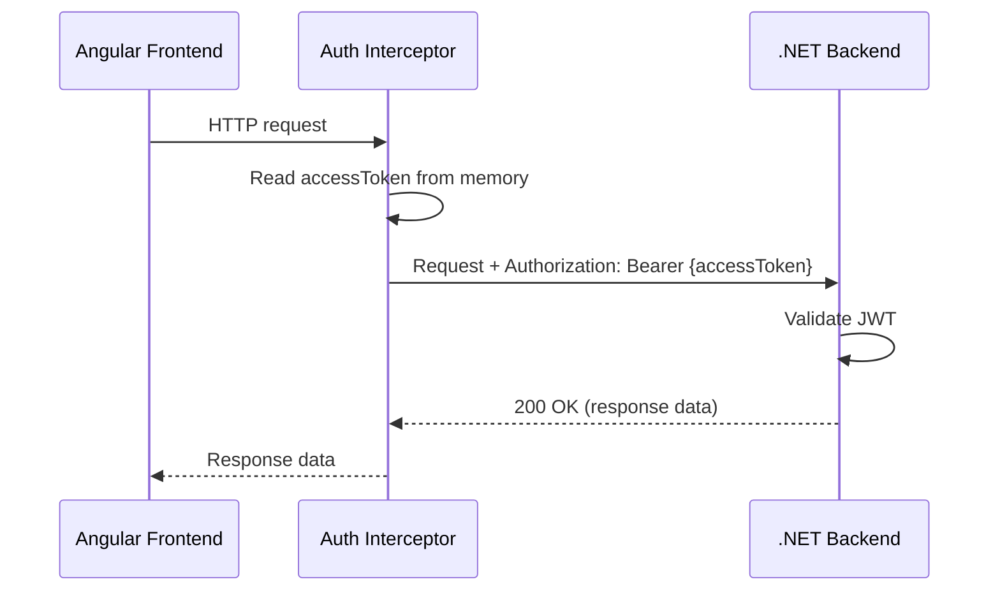
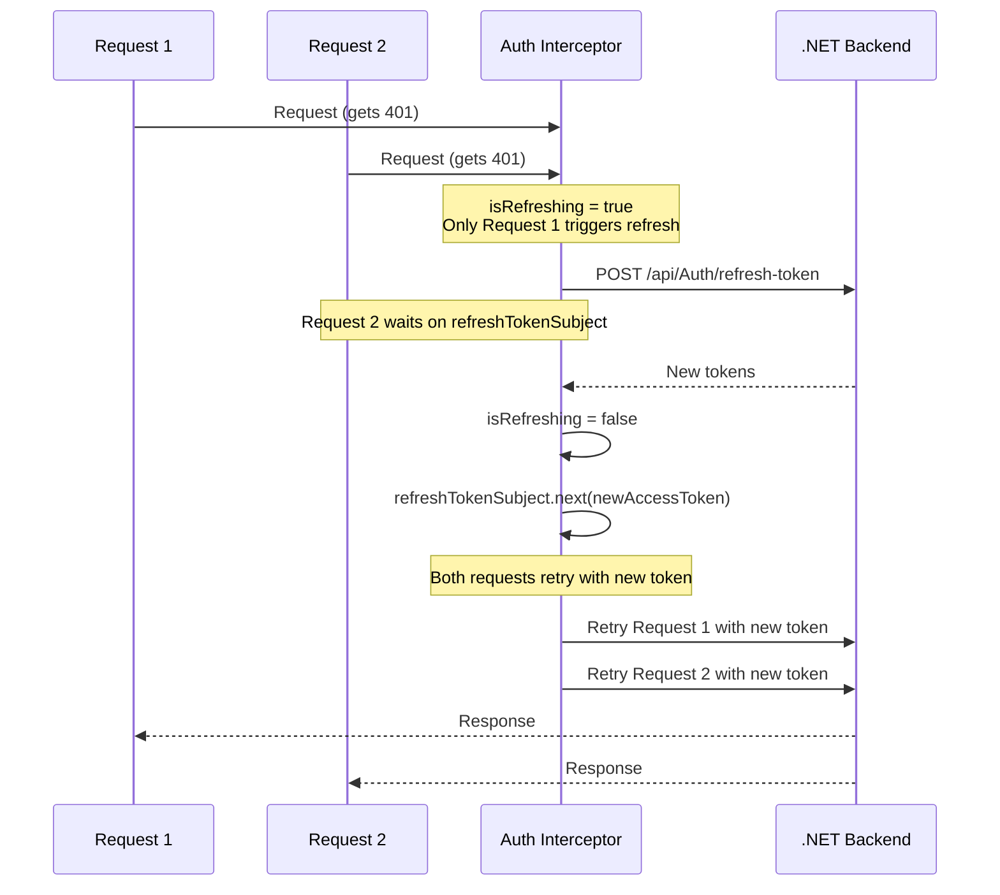
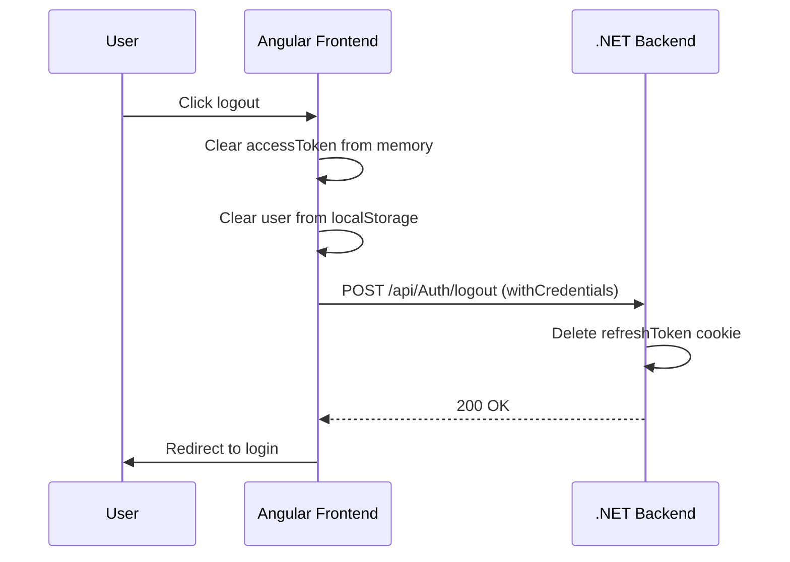
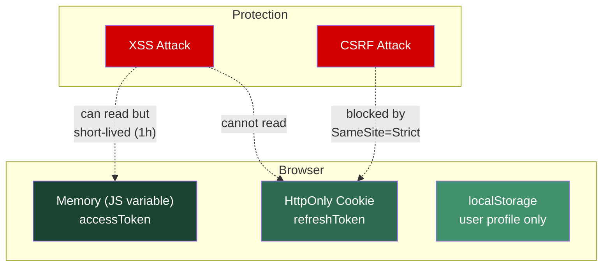
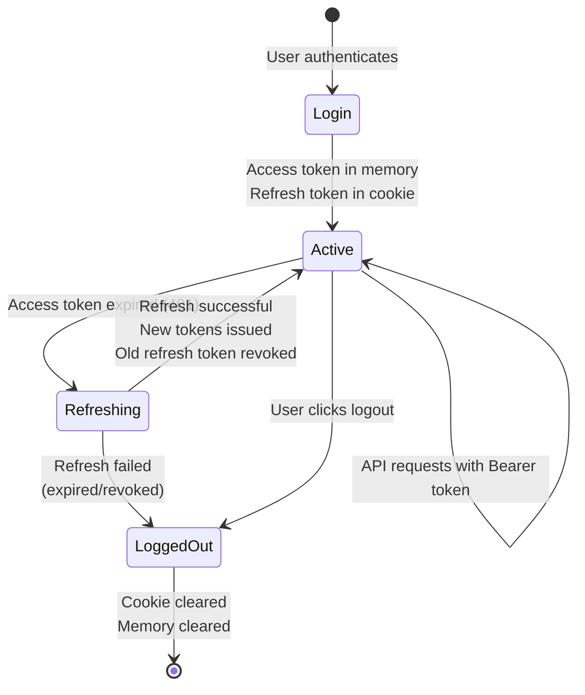

# Authentication Token Flow

## Overview

- **Access Token**: Stored in memory (JavaScript variable), sent as `Authorization: Bearer` header
- **Refresh Token**: Stored as `HttpOnly`, `Secure`, `SameSite=Strict` cookie, managed by browser automatically

---

## Login Flow

```mermaid
sequenceDiagram
    participant U as User
    participant FE as Angular Frontend
    participant BE as .NET Backend
    participant DB as Database

    U->>FE: Enter credentials
    FE->>BE: POST /api/Auth/login<br/>{username, password}
    BE->>DB: Find user by username
    DB-->>BE: User record
    BE->>BE: Verify password hash
    BE->>BE: Generate access token (JWT, 1h)
    BE->>BE: Generate refresh token (random)
    BE->>DB: Save refresh token (7d expiry)
    BE-->>FE: Response body: {accessToken, expiresAt, user}<br/>Set-Cookie: refreshToken=xxx; HttpOnly; Secure; SameSite=Strict
    FE->>FE: Store accessToken in memory
    FE->>FE: Store user in localStorage
    FE->>U: Redirect to dashboard
```

## Authenticated Request Flow



## Token Refresh Flow (on 401)

```mermaid
sequenceDiagram
    participant FE as Angular Frontend
    participant INT as Auth Interceptor
    participant BE as .NET Backend
    participant DB as Database

    FE->>INT: HTTP request
    INT->>BE: Request + Authorization: Bearer {expired accessToken}
    BE-->>INT: 401 Unauthorized

    Note over INT: Interceptor catches 401

    INT->>BE: POST /api/Auth/refresh-token<br/>Cookie: refreshToken=xxx (sent by browser)
    BE->>DB: Find refresh token (not revoked, not expired)
    DB-->>BE: Stored token record
    BE->>DB: Revoke old refresh token
    BE->>BE: Generate new access token
    BE->>BE: Generate new refresh token
    BE->>DB: Save new refresh token
    BE-->>INT: Response body: {accessToken, expiresAt, user}<br/>Set-Cookie: refreshToken=newXxx; HttpOnly; Secure; SameSite=Strict
    INT->>INT: Store new accessToken in memory

    Note over INT: Retry original request

    INT->>BE: Original request + Authorization: Bearer {new accessToken}
    BE-->>INT: 200 OK (response data)
    INT-->>FE: Response data
```

## Concurrent Requests During Refresh



## Logout Flow



## Security Architecture



## Token Lifecycle


