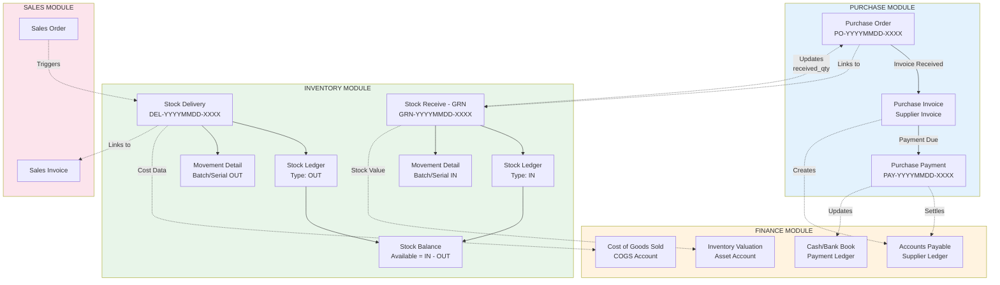
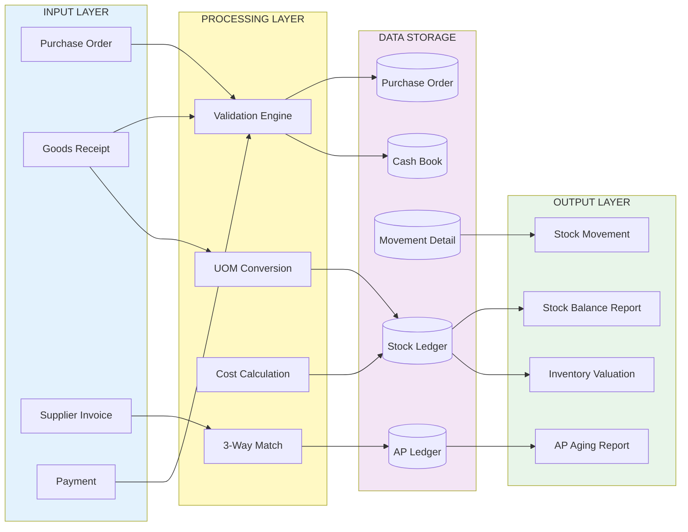

# Complete ERP Workflow Overview - Inventory & Purchase Integration

## Executive Summary

This document provides a high-level overview of how the Inventory and Purchase modules work together in the SmallBiz ERP system. It shows the complete flow from creating a purchase order to receiving stock and managing inventory.

---

## 1. Complete Business Process Flow - Purchase to Inventory

```mermaid
flowchart TD
    Start([Start Business Process]) --> NeedStock{Need to Restock?}

    NeedStock -->|Yes| CheckInventory["Check Stock Levels:<br/>Query Stock Ledger"]

    CheckInventory --> LowStock{Stock Below<br/>Reorder Level?}
    LowStock -->|Yes| CreatePR[Create Purchase Requisition]
    LowStock -->|No| MonitorStock[Monitor Stock Levels]
    MonitorStock --> End

    CreatePR --> CreatePO["CREATE PURCHASE ORDER<br/>━━━━━━━━━━━━━━━━<br/>1. Select Supplier<br/>2. Select Main Warehouse<br/>3. Add Product Lines<br/>4. Enter Qty & Price<br/>5. Status: DRAFT → APPROVED"]

    CreatePO --> SendPOToSupplier["Send PO to Supplier<br/>PO-YYYYMMDD-XXXX"]

    SendPOToSupplier --> WaitDelivery[Wait for Goods Delivery]
    WaitDelivery --> GoodsArrived{Goods Arrived?}

    GoodsArrived -->|No| WaitDelivery
    GoodsArrived -->|Yes| CreateGRN["CREATE STOCK RECEIVE (GRN)<br/>━━━━━━━━━━━━━━━━<br/>1. Link to Purchase Order<br/>2. Select Main Warehouse<br/>3. Verify Products & Qty<br/>4. Enter Batch/Serial (if required)<br/>5. Status: DRAFT → POSTED"]

    CreateGRN --> PostGRN["POST GRN<br/>━━━━━━━━━━━━━━━━<br/>✓ Generate GRN-YYYYMMDD-XXXX<br/>✓ Write Stock Ledger (IN)<br/>✓ Record Batch/Serial<br/>✓ Update PO received_qty"]

    PostGRN --> UpdatePOStatus["Update Purchase Order:<br/>- PO Line: received_qty += qty<br/>- Status: PARTIAL_RECEIVED or FULL_RECEIVED"]

    UpdatePOStatus --> StockAvailable["STOCK NOW AVAILABLE<br/>━━━━━━━━━━━━━━━━<br/>Stock Balance Updated<br/>Available for Sale/Issue"]

    StockAvailable --> SupplierInvoice{Supplier Invoice<br/>Received?}

    SupplierInvoice -->|Not Yet| WaitInvoice[Wait for Invoice]
    WaitInvoice --> SupplierInvoice

    SupplierInvoice -->|Yes| CreatePI["CREATE PURCHASE INVOICE<br/>━━━━━━━━━━━━━━━━<br/>1. Enter Invoice No & Date<br/>2. Link to PO & GRN<br/>3. Perform 3-Way Match<br/>4. Status: DRAFT → POSTED"]

    CreatePI --> PostInvoice["POST INVOICE<br/>━━━━━━━━━━━━━━━━<br/>✓ Create AP Ledger Entry<br/>✓ Update Supplier Balance<br/>✓ Status: POSTED"]

    PostInvoice --> PaymentDue{Payment Due?}

    PaymentDue -->|Not Yet| WaitPayment[Wait for Payment Date]
    WaitPayment --> PaymentDue

    PaymentDue -->|Yes| CreatePayment["CREATE PURCHASE PAYMENT<br/>━━━━━━━━━━━━━━━━<br/>1. Select Invoice<br/>2. Enter Payment Amount<br/>3. Select Method (Cash/Bank/Transfer)<br/>4. Status: DRAFT → CONFIRMED"]

    CreatePayment --> ConfirmPayment["CONFIRM PAYMENT<br/>━━━━━━━━━━━━━━━━<br/>✓ Update AP Ledger<br/>✓ Update Cash/Bank<br/>✓ Invoice: PARTIAL_PAID or PAID"]

    ConfirmPayment --> CycleBranch{More Purchases?}
    CycleBranch -->|Yes| NeedStock

    CycleBranch -->|No| SalesOrder{Sales Order<br/>Received?}

    SalesOrder -->|Yes| CreateDelivery["CREATE STOCK DELIVERY<br/>━━━━━━━━━━━━━━━━<br/>1. Type: SALE<br/>2. Select Customer<br/>3. Select Warehouse<br/>4. Add Products & Qty<br/>5. Check Stock Availability<br/>6. Select Batch/Serial"]

    CreateDelivery --> ValidateStock{Stock<br/>Available?}

    ValidateStock -->|No| ErrorStock[Error: Insufficient Stock]
    ErrorStock --> CreatePR

    ValidateStock -->|Yes| PostDelivery["POST DELIVERY<br/>━━━━━━━━━━━━━━━━<br/>✓ Generate DEL-YYYYMMDD-XXXX<br/>✓ Write Stock Ledger (OUT)<br/>✓ Record Batch/Serial OUT<br/>✓ Calculate COGS (FIFO/AVG)"]

    PostDelivery --> DeductStock["DEDUCT STOCK<br/>━━━━━━━━━━━━━━━━<br/>Stock Balance Reduced<br/>Link to Sales Invoice"]

    DeductStock --> CheckStock["Monitor Stock Levels<br/>Check Reorder Point"]

    CheckStock --> NeedStock

    SalesOrder -->|No| End([End - Cycle Complete])

    style CreatePO fill:#87CEEB
    style CreateGRN fill:#90EE90
    style PostGRN fill:#98FB98
    style CreatePI fill:#DDA0DD
    style PostInvoice fill:#FFB6C1
    style CreatePayment fill:#F0E68C
    style ConfirmPayment fill:#FFD700
    style CreateDelivery fill:#FF6B6B
    style PostDelivery fill:#FFB6C1
    style ErrorStock fill:#FF4444
    style StockAvailable fill:#00FF00
```



---

## 2. Module Integration Map



---

## 3. Data Flow Architecture



---

## 4. Key Business Rules Summary

### Purchase Module Rules

| Rule Category | Description |
|--------------|-------------|
| **Purchase Order** | • DRAFT → APPROVED → PARTIAL_RECEIVED → FULL_RECEIVED<br/>• Only APPROVED PO can receive stock<br/>• Auto-generate PO number |
| **Purchase Invoice** | • Must link to PO or GRN (optional)<br/>• 3-Way Match: PO vs GRN vs Invoice<br/>• Create AP entry when POSTED |
| **Purchase Payment** | • Cannot exceed invoice outstanding<br/>• Supports partial payments<br/>• Update AP ledger when CONFIRMED |

### Inventory Module Rules

| Rule Category | Description |
|--------------|-------------|
| **Stock Receive** | • Only Main Warehouse can receive<br/>• Must convert to base UOM<br/>• Create ledger entry when POSTED |
| **Stock Delivery** | • Check stock availability<br/>• Honor allow_negative_stock flag<br/>• Use FIFO/AVG for costing |
| **Stock Ledger** | • Immutable - never update/delete<br/>• Always use base UOM<br/>• Balance = SUM(IN) - SUM(OUT) |

### Integration Rules

| Rule Category | Description |
|--------------|-------------|
| **PO to GRN** | • GRN updates PO.received_quantity<br/>• PO status changes based on received qty |
| **GRN to Inventory** | • GRN writes Stock Ledger (IN)<br/>• Records batch/serial tracking |
| **Delivery to Sales** | • Stock Delivery links to Sales Invoice<br/>• COGS calculated from stock cost |

---

## 5. Critical Workflows at a Glance

### 5.1 Purchase Order Creation

```
1. Create PO (DRAFT)
2. Add Supplier & Warehouse (Main only)
3. Add Product Lines
4. Enter Qty & Price
5. Approve PO (APPROVED)
6. Send to Supplier
```

### 5.2 Stock Receiving (GRN)

```
1. Create GRN (DRAFT)
2. Link to PO (optional)
3. Select Main Warehouse
4. Add Product Lines
5. Enter Received Qty
6. Enter Batch/Serial (if required)
7. Post GRN (POSTED)
8. Stock Ledger Updated (IN)
9. PO received_qty Updated
```

### 5.3 Purchase Invoice Processing

```
1. Create Invoice (DRAFT)
2. Enter Invoice No & Date
3. Link to PO & GRN
4. 3-Way Match Validation
5. Post Invoice (POSTED)
6. AP Ledger Created
7. Supplier Balance Increased
```

### 5.4 Payment Processing

```
1. Create Payment (DRAFT)
2. Select Invoice
3. Enter Payment Amount
4. Select Payment Method
5. Confirm Payment (CONFIRMED)
6. AP Ledger Updated
7. Cash/Bank Updated
8. Invoice Status: PARTIAL_PAID or PAID
```

### 5.5 Stock Delivery (Sale)

```
1. Create Delivery (Type: SALE)
2. Select Customer & Warehouse
3. Add Product Lines
4. Check Stock Availability
5. Select Batch/Serial (if required)
6. Post Delivery
7. Stock Ledger Updated (OUT)
8. Link to Sales Invoice
9. COGS Calculated
```

---

## 6. Status Transition Summary

### Purchase Order Status

```
DRAFT → APPROVED → PARTIAL_RECEIVED → FULL_RECEIVED
         ↓
     CANCELLED
```

### Purchase Invoice Status

```
DRAFT → POSTED → PARTIAL_PAID → PAID
         ↓
     CANCELLED
```

### Stock Receive Status

```
DRAFT → POSTED
  ↓
CANCELLED
```

### Stock Delivery Status

```
DRAFT → POSTED
  ↓
CANCELLED
```

---

## 7. Document Numbering Conventions

| Document Type | Format | Example |
|--------------|--------|---------|
| Purchase Order | PO-YYYYMMDD-XXXX | PO-20260212-0001 |
| Stock Receive (GRN) | GRN-YYYYMMDD-XXXX | GRN-20260212-0001 |
| Stock Delivery | DEL-YYYYMMDD-XXXX | DEL-20260212-0001 |
| Purchase Payment | PAY-YYYYMMDD-XXXX | PAY-20260212-0001 |

---

## 8. Sample End-to-End Scenario

### Scenario: Purchase 100 Pieces of Product A

```
Step 1: Create Purchase Order
━━━━━━━━━━━━━━━━━━━━━━━━━━
Document: PO-20260212-0001
Supplier: ABC Suppliers
Product: Product A
Quantity: 100 pieces @ $10/piece
Total: $1,000
Status: APPROVED

Step 2: Receive Stock (GRN)
━━━━━━━━━━━━━━━━━━━━━━━━━━
Document: GRN-20260213-0001
Linked to: PO-20260212-0001
Warehouse: Main Warehouse
Product: Product A
Quantity: 60 pieces (Partial Receipt)
Status: POSTED

Stock Ledger Impact:
• Type: IN
• Quantity: +60 pieces
• Value: +$600

PO Update:
• received_quantity: 60/100
• Status: PARTIAL_RECEIVED

Step 3: Second GRN (Complete Receipt)
━━━━━━━━━━━━━━━━━━━━━━━━━━
Document: GRN-20260215-0001
Linked to: PO-20260212-0001
Quantity: 40 pieces
Status: POSTED

Stock Ledger Impact:
• Type: IN
• Quantity: +40 pieces
• Value: +$400

PO Update:
• received_quantity: 100/100
• Status: FULL_RECEIVED

Step 4: Supplier Invoice
━━━━━━━━━━━━━━━━━━━━━━━━━━
Document: INV-SUPP-001
Linked to: PO-20260212-0001
Amount: $1,000
Status: POSTED

Finance Impact:
• Debit: Inventory $1,000
• Credit: Accounts Payable $1,000

Step 5: Payment (Partial)
━━━━━━━━━━━━━━━━━━━━━━━━━━
Document: PAY-20260220-0001
Invoice: INV-SUPP-001
Amount: $600
Method: Bank Transfer
Status: CONFIRMED

Finance Impact:
• Debit: AP $600
• Credit: Bank $600
• Invoice Outstanding: $400
• Invoice Status: PARTIAL_PAID

Step 6: Final Payment
━━━━━━━━━━━━━━━━━━━━━━━━━━
Document: PAY-20260225-0001
Invoice: INV-SUPP-001
Amount: $400
Method: Cash
Status: CONFIRMED

Finance Impact:
• Debit: AP $400
• Credit: Cash $400
• Invoice Outstanding: $0
• Invoice Status: PAID

Step 7: Stock Delivery (Sale)
━━━━━━━━━━━━━━━━━━━━━━━━━━
Document: DEL-20260226-0001
Type: SALE
Customer: Customer XYZ
Product: Product A
Quantity: 50 pieces
Cost: $10/piece (FIFO)

Stock Ledger Impact:
• Type: OUT
• Quantity: -50 pieces
• Value: -$500

Finance Impact:
• COGS: $500

Current Stock Balance:
━━━━━━━━━━━━━━━━━━━━━━━━━━
Product A @ Main Warehouse:
• Total IN: 100 pieces
• Total OUT: 50 pieces
• Available: 50 pieces
• Value: $500
```

---

## 9. Reporting & Analytics

### Stock Reports

| Report | Description |
|--------|-------------|
| **Stock Balance** | Current stock by warehouse, product, variant |
| **Stock Movement** | IN/OUT transactions with details |
| **Stock Valuation** | Total inventory value (FIFO/AVG) |
| **Batch/Serial Tracking** | Movement history, expiry dates |
| **Reorder Report** | Products below reorder level |

### Purchase Reports

| Report | Description |
|--------|-------------|
| **PO Status** | Open, Partial, Fully Received POs |
| **GRN Report** | Goods received history |
| **AP Aging** | Outstanding invoices by age |
| **Supplier Analysis** | Purchase volume, payment history |
| **3-Way Match** | PO vs GRN vs Invoice comparison |

---

## 10. System Validation Points

### Before Creating Purchase Order

- ✓ Supplier exists and is active
- ✓ Warehouse is Main Warehouse
- ✓ Products are valid and active
- ✓ UOMs are configured

### Before Posting GRN

- ✓ Warehouse is Main Warehouse
- ✓ Products have correct variants (if applicable)
- ✓ Batch/Serial numbers entered (if required)
- ✓ Received qty doesn't exceed PO qty (warning)
- ✓ UOM conversion is valid

### Before Posting Purchase Invoice

- ✓ Invoice number unique per supplier
- ✓ 3-Way match within tolerance
- ✓ Linked PO/GRN exists (if specified)
- ✓ Invoice date ≤ current date

### Before Confirming Payment

- ✓ Payment amount ≤ invoice outstanding
- ✓ Payment method selected
- ✓ Bank/Transfer reference entered (if required)

### Before Posting Stock Delivery

- ✓ Stock availability checked
- ✓ Negative stock allowed (if going negative)
- ✓ Batch/Serial available (if required)
- ✓ Serial numbers not already used
- ✓ Customer exists (for SALE type)

---

## 11. Error Handling

### Common Errors and Solutions

| Error | Cause | Solution |
|-------|-------|----------|
| Cannot receive to Branch warehouse | Selected non-main warehouse | Select Main Warehouse only |
| Variant required | Product has variants | Select specific variant |
| Insufficient stock | Stock balance too low | Check stock or allow negative |
| Serial already used | Serial number duplicate | Enter unique serial number |
| Payment exceeds outstanding | Payment > invoice balance | Enter correct amount |
| 3-Way match failed | PO, GRN, Invoice mismatch | Verify quantities and prices |

---

## 12. Best Practices

### Purchase Management

1. ✅ Always approve PO before sending to supplier
2. ✅ Link GRN to PO for accurate tracking
3. ✅ Perform 3-way match before posting invoice
4. ✅ Make timely payments to maintain supplier relationships
5. ✅ Review PO status regularly

### Inventory Management

1. ✅ Receive stock only at Main Warehouse
2. ✅ Always enter batch numbers for expiry tracking
3. ✅ Record serial numbers for high-value items
4. ✅ Perform regular stock counts
5. ✅ Monitor reorder levels
6. ✅ Use FIFO for perishable items

### Data Integrity

1. ✅ Never delete posted transactions
2. ✅ Use cancellation for corrections
3. ✅ Maintain audit trail
4. ✅ Regular backups
5. ✅ User access controls

---

## 13. Quick Reference Guide

### User Roles & Permissions

| Role | Purchase Module | Inventory Module |
|------|----------------|------------------|
| **Purchase Manager** | Create/Approve PO<br/>Create Invoice<br/>Create Payment | View Stock Reports |
| **Warehouse Manager** | View PO | Create/Post GRN<br/>Create/Post Delivery<br/>Stock Reports |
| **Accountant** | View PO/Invoice<br/>Approve Payment | View Valuation |
| **Sales Person** | View PO | Create Delivery (SALE)<br/>Check Stock |

### System Access Points

- **Purchase Order**: Purchase → Purchase Order → Create New
- **Stock Receive**: Inventory → Stock Receive → Create GRN
- **Purchase Invoice**: Purchase → Invoices → Create Invoice
- **Payment**: Purchase → Payments → Create Payment
- **Stock Delivery**: Inventory → Stock Delivery → Create Delivery
- **Reports**: Reports → Inventory/Purchase

---

## 14. Future Enhancements

### Planned Features

- [ ] **Stock Transfer**: Move stock between warehouses
- [ ] **Stock Adjustment**: Adjust stock for count discrepancies
- [ ] **Barcode Scanning**: For faster GRN and delivery
- [ ] **Batch Expiry Alerts**: Notify before batch expiry
- [ ] **Auto PO Generation**: Based on reorder levels
- [ ] **Supplier Portal**: For PO confirmation
- [ ] **Mobile App**: For warehouse operations

---

**Document Version**: 1.0
**Created**: 2026-02-12
**Author**: SmallBiz ERP Documentation Team
**Based on**:
- INVENTORY_DATABASE_NOTES.txt
- PURCHASE_MODULE_ERD_FLOWCHART.md
- INVENTORY_MODULE_ERD_FLOWCHART.md

**Purpose**: Comprehensive overview of Purchase and Inventory module integration for stakeholders, developers, and end-users.
