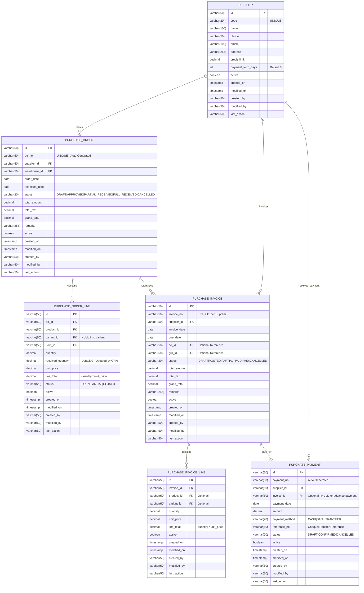
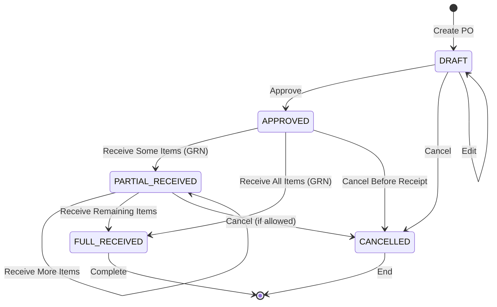
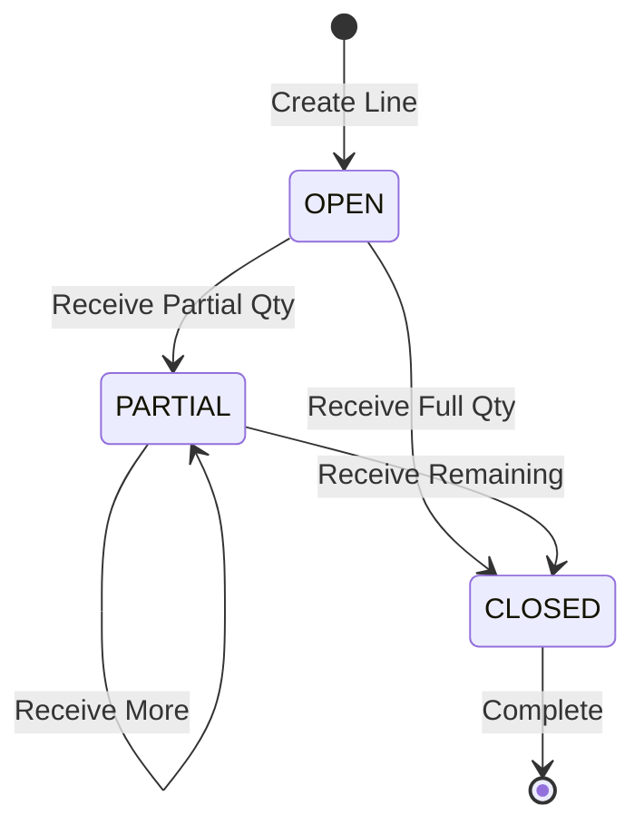
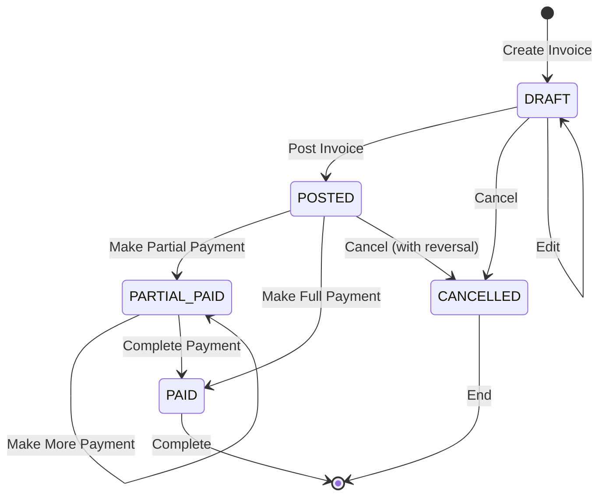
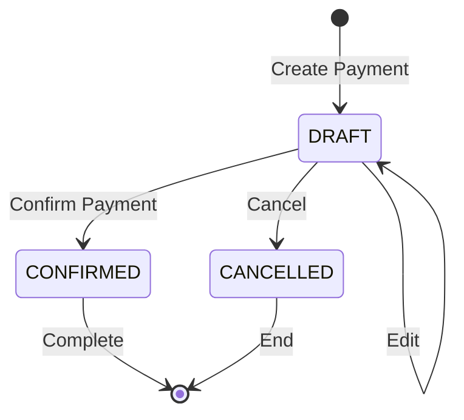

# Purchase Module - ERD and Flowcharts

## 1. Purchase Module Entity Relationship Diagram (ERD)



---

## 2. Complete Purchase Process Flow

```mermaid
flowchart TD
    Start([Start Purchase Process]) --> CreatePO[Create Purchase Order]

    CreatePO --> EnterPODetails[Enter PO Details]
    EnterPODetails --> SelectSupplier[Select Supplier]
    SelectSupplier --> SelectWarehouse[Select Warehouse<br/>Must be Main Warehouse]
    SelectWarehouse --> SetDates["Set Order Date<br/>Set Expected Delivery Date"]

    SetDates --> AddPOLines[Add Purchase Order Lines]
    AddPOLines --> SelectProduct[Select Product/Variant]
    SelectProduct --> HasVariant{Product Has Variant?}

    HasVariant -->|Yes| MustSelectVariant[Variant Selection Required]
    HasVariant -->|No| SelectUOM[Select UOM]
    MustSelectVariant --> SelectUOM

    SelectUOM --> EnterQuantity[Enter Order Quantity]
    EnterQuantity --> EnterUnitPrice[Enter Unit Price]
    EnterUnitPrice --> CalcLineTotal["Line Total = Qty × Price"]
    CalcLineTotal --> LineStatus[Line Status: OPEN]
    LineStatus --> MorePOLines{Add More Lines?}

    MorePOLines -->|Yes| AddPOLines
    MorePOLines -->|No| CalcPOTotal["Calculate PO Totals:<br/>- Total Amount<br/>- Total Tax<br/>- Grand Total"]

    CalcPOTotal --> AddRemarks[Add Remarks - Optional]
    AddRemarks --> SavePOAction{Save Action?}

    SavePOAction -->|Save as Draft| POStatusDraft[PO Status: DRAFT]
    SavePOAction -->|Approve| ValidatePO{Validate PO?}

    ValidatePO -->|Invalid| ShowErrors[Show Validation Errors]
    ShowErrors --> EnterPODetails

    ValidatePO -->|Valid| POStatusApproved[PO Status: APPROVED]
    POStatusDraft --> EditPO{Need to Edit?}

    EditPO -->|Yes| EnterPODetails
    EditPO -->|No| ApprovePO[Approve PO]
    ApprovePO --> POStatusApproved

    POStatusApproved --> GeneratePONo["Generate PO Number:<br/>PO-YYYYMMDD-XXXX"]
    GeneratePONo --> SendToSupplier[Send PO to Supplier]
    SendToSupplier --> WaitDelivery[Wait for Goods Delivery]

    WaitDelivery --> GoodsArrived{Goods Arrived?}
    GoodsArrived -->|No| WaitDelivery
    GoodsArrived -->|Yes| GRNProcess[Go to GRN Process]

    GRNProcess --> POLineUpdate["Update PO Lines:<br/>received_quantity += GRN qty"]
    POLineUpdate --> CheckLineComplete{Line Fully Received?}

    CheckLineComplete -->|received_qty < qty| LinePartial[Line Status: PARTIAL]
    CheckLineComplete -->|received_qty = qty| LineClosed[Line Status: CLOSED]

    LinePartial --> CheckAllPOLines{Check All Lines}
    LineClosed --> CheckAllPOLines

    CheckAllPOLines --> AnyPartial{Any PARTIAL or OPEN?}
    AnyPartial -->|Yes| POPartialReceived[PO Status: PARTIAL_RECEIVED]
    AnyPartial -->|No| POFullReceived[PO Status: FULL_RECEIVED]

    POPartialReceived --> MoreDeliveries{More Deliveries Expected?}
    POFullReceived --> MoreDeliveries

    MoreDeliveries -->|Yes| WaitDelivery
    MoreDeliveries -->|No| InvoiceReady{Supplier Invoice Received?}

    InvoiceReady -->|Not Yet| WaitInvoice[Wait for Invoice]
    WaitInvoice --> InvoiceReady

    InvoiceReady -->|Yes| CreateInvoice[Create Purchase Invoice]
    CreateInvoice --> EnterInvoiceDetails["Enter Invoice Details:<br/>- Invoice No<br/>- Invoice Date<br/>- Due Date"]

    EnterInvoiceDetails --> LinkPO[Link to PO - Optional]
    LinkPO --> LinkGRN[Link to GRN - Optional]
    LinkGRN --> AddInvoiceLines[Add Invoice Lines]

    AddInvoiceLines --> Match3Way{Perform 3-Way Match?}
    Match3Way -->|Yes| Compare["Compare:<br/>1. PO Quantity & Price<br/>2. GRN Received Quantity<br/>3. Invoice Quantity & Price"]

    Compare --> MatchResult{Match OK?}
    MatchResult -->|Discrepancy Found| ResolveDiscrepancy[Resolve Discrepancy<br/>with Supplier]
    ResolveDiscrepancy --> Match3Way

    MatchResult -->|Match OK| CalcInvoiceTotal
    Match3Way -->|No| CalcInvoiceTotal["Calculate Invoice Total"]

    CalcInvoiceTotal --> SaveInvoiceAction{Save Action?}
    SaveInvoiceAction -->|Save as Draft| InvoiceDraft[Invoice Status: DRAFT]
    SaveInvoiceAction -->|Post Invoice| PostInvoice[Invoice Status: POSTED]

    InvoiceDraft --> EditInvoice{Need to Edit?}
    EditInvoice -->|Yes| EnterInvoiceDetails
    EditInvoice -->|No| PostInvoiceNow[Post Invoice]
    PostInvoiceNow --> PostInvoice

    PostInvoice --> CreateAPEntry["Create AP Entry:<br/>Debit: Expense/Inventory<br/>Credit: Accounts Payable"]
    CreateAPEntry --> GenerateInvoiceNo["Generate Invoice Number"]
    GenerateInvoiceNo --> InvoicePosted[Invoice Recorded]

    InvoicePosted --> PaymentDue{Payment Due?}
    PaymentDue -->|Not Yet| WaitPaymentDate[Wait for Payment Date]
    WaitPaymentDate --> PaymentDue

    PaymentDue -->|Yes| CreatePayment[Create Purchase Payment]
    CreatePayment --> SelectInvoice[Select Invoice to Pay]
    SelectInvoice --> CheckOutstanding["Check Outstanding Amount:<br/>Invoice Total - Paid Amount"]

    CheckOutstanding --> EnterPaymentAmount[Enter Payment Amount]
    EnterPaymentAmount --> ValidateAmount{Amount <= Outstanding?}

    ValidateAmount -->|No| ErrorOverPayment[Error: Payment Exceeds<br/>Outstanding Amount]
    ErrorOverPayment --> EnterPaymentAmount

    ValidateAmount -->|Yes| SelectPaymentMethod{Select Payment Method}
    SelectPaymentMethod -->|Cash| PayCash[Method: CASH]
    SelectPaymentMethod -->|Bank| PayBank[Method: BANK]
    SelectPaymentMethod -->|Transfer| PayTransfer[Method: TRANSFER]

    PayCash --> EnterReference[Enter Reference No - Optional]
    PayBank --> EnterReference
    PayTransfer --> EnterReference

    EnterReference --> SavePaymentAction{Save Action?}
    SavePaymentAction -->|Save as Draft| PaymentDraft[Payment Status: DRAFT]
    SavePaymentAction -->|Confirm| ConfirmPayment[Payment Status: CONFIRMED]

    PaymentDraft --> EditPayment{Need to Edit?}
    EditPayment -->|Yes| CreatePayment
    EditPayment -->|No| ConfirmPaymentNow[Confirm Payment]
    ConfirmPaymentNow --> ConfirmPayment

    ConfirmPayment --> UpdateAPLedger["Update AP Ledger:<br/>Debit: Accounts Payable<br/>Credit: Cash/Bank"]
    UpdateAPLedger --> GeneratePaymentNo["Generate Payment Number:<br/>PAY-YYYYMMDD-XXXX"]
    GeneratePaymentNo --> CalcNewOutstanding["New Outstanding =<br/>Invoice Total - Total Paid"]

    CalcNewOutstanding --> CheckInvoicePaid{Invoice Fully Paid?}
    CheckInvoicePaid -->|Outstanding > 0| InvoicePartialPaid[Invoice Status: PARTIAL_PAID]
    CheckInvoicePaid -->|Outstanding = 0| InvoicePaid[Invoice Status: PAID]

    InvoicePartialPaid --> MorePaymentsNeeded{More Payments?}
    InvoicePaid --> MorePaymentsNeeded

    MorePaymentsNeeded -->|Yes| PaymentDue
    MorePaymentsNeeded -->|No| ClosePO{Close PO?}

    ClosePO -->|Yes| POClosed[PO Completed & Closed]
    ClosePO -->|No| KeepOpen[Keep PO Open]

    POClosed --> End1([End - Purchase Complete])
    KeepOpen --> End2([End - Purchase Complete])

    style Start fill:#90EE90
    style End1 fill:#90EE90
    style End2 fill:#90EE90
    style POStatusApproved fill:#87CEEB
    style PostInvoice fill:#DDA0DD
    style ConfirmPayment fill:#F0E68C
    style CreateAPEntry fill:#FFB6C1
    style UpdateAPLedger fill:#98FB98
    style ErrorOverPayment fill:#FFB6C1
    style ShowErrors fill:#FFB6C1
```



---

## 3. Purchase Order Creation Flow

```mermaid
flowchart TD
    Start([Create Purchase Order]) --> Init[Initialize New PO]
    Init --> SetStatus[Status: DRAFT]

    SetStatus --> SupplierForm[Supplier Selection Form]
    SupplierForm --> SearchSupplier{Search Supplier}
    SearchSupplier -->|Existing| SelectExisting[Select from List]
    SearchSupplier -->|New| CreateSupplier[Create New Supplier]

    CreateSupplier --> EnterSupplierDetails["Enter Supplier Details:<br/>- Code<br/>- Name<br/>- Contact Info<br/>- Credit Limit<br/>- Payment Terms"]
    EnterSupplierDetails --> SaveSupplier[Save Supplier]
    SaveSupplier --> SelectExisting

    SelectExisting --> LoadSupplierInfo["Load Supplier Info:<br/>- Credit Limit<br/>- Payment Terms<br/>- Outstanding Balance"]

    LoadSupplierInfo --> CheckCredit{Check Credit Limit}
    CheckCredit -->|Exceeded| WarningCredit[Warning: Credit Limit Exceeded]
    CheckCredit -->|OK| WarehouseForm
    WarningCredit --> ProceedAnyway{Proceed Anyway?}

    ProceedAnyway -->|No| SupplierForm
    ProceedAnyway -->|Yes| WarehouseForm[Warehouse Selection]

    WarehouseForm --> SelectWH[Select Warehouse]
    SelectWH --> ValidateWH{Is Main Warehouse?}
    ValidateWH -->|No| ErrorWH[Error: Must select<br/>Main Warehouse]
    ErrorWH --> SelectWH
    ValidateWH -->|Yes| DateForm[Date Selection]

    DateForm --> SetOrderDate[Set Order Date - Default Today]
    SetOrderDate --> SetExpectedDate[Set Expected Delivery Date]
    SetExpectedDate --> ProductLineSection[Product Line Section]

    ProductLineSection --> AddLine[Add Line Item]
    AddLine --> ProductSearch[Search/Select Product]
    ProductSearch --> CheckVariant{Has Variant?}

    CheckVariant -->|Yes| VariantRequired[Variant Selection Required]
    CheckVariant -->|No| UOMSelection[UOM Selection]
    VariantRequired --> VariantForm[Select Variant<br/>Color/Size/etc]
    VariantForm --> UOMSelection

    UOMSelection --> LoadProductUOM["Load Available UOMs:<br/>- Base UOM<br/>- Alternate UOMs<br/>- Conversion Factors"]
    LoadProductUOM --> SelectUOM[Select Transaction UOM]
    SelectUOM --> QtyInput[Enter Quantity]

    QtyInput --> ValidateQty{Quantity > 0?}
    ValidateQty -->|No| ErrorQty[Error: Invalid Quantity]
    ErrorQty --> QtyInput
    ValidateQty -->|Yes| PriceInput[Enter Unit Price]

    PriceInput --> ValidatePrice{Price >= 0?}
    ValidatePrice -->|No| ErrorPrice[Error: Invalid Price]
    ErrorPrice --> PriceInput
    ValidatePrice -->|Yes| CalculateLine["Calculate:<br/>Line Total = Qty × Price"]

    CalculateLine --> TaxInput{Add Tax?}
    TaxInput -->|Yes| EnterTax[Enter Tax Percentage]
    TaxInput -->|No| DiscountInput
    EnterTax --> CalcLineTax["Line Tax = Total × Tax%"]
    CalcLineTax --> DiscountInput{Add Discount?}

    DiscountInput -->|Yes| EnterDiscount[Enter Discount]
    DiscountInput -->|No| SetLineStatus
    EnterDiscount --> CalcLineDiscount["Line Discount = Total × Disc%"]
    CalcLineDiscount --> SetLineStatus[Line Status: OPEN<br/>Received Qty: 0]

    SetLineStatus --> SaveLine[Save Line Item]
    SaveLine --> UpdatePOTotal["Update PO Totals:<br/>Total Amount += Line Total<br/>Total Tax += Line Tax<br/>Grand Total = Total + Tax - Discount"]

    UpdatePOTotal --> MoreLines{Add More Lines?}
    MoreLines -->|Yes| AddLine
    MoreLines -->|No| ReviewPO[Review PO Summary]

    ReviewPO --> ShowTotals["Display:<br/>- Total Lines Count<br/>- Total Amount<br/>- Total Tax<br/>- Grand Total"]
    ShowTotals --> RemarksInput{Add Remarks?}

    RemarksInput -->|Yes| EnterRemarks[Enter Remarks/Notes]
    RemarksInput -->|No| SaveOptions
    EnterRemarks --> SaveOptions[Save Options]

    SaveOptions --> UserChoice{User Action}
    UserChoice -->|Save Draft| SaveDraft[Save as DRAFT]
    UserChoice -->|Approve & Send| ApproveValidate{Validate All Fields}
    UserChoice -->|Cancel| CancelPO[Discard Changes]

    ApproveValidate -->|Invalid| ValidationErrors["Show Errors:<br/>- Missing Fields<br/>- Invalid Values"]
    ValidationErrors --> ProductLineSection

    ApproveValidate -->|Valid| Approve[Status: APPROVED]
    Approve --> GeneratePONumber["Generate PO Number:<br/>PO-YYYYMMDD-XXXX"]
    GeneratePONumber --> LockPO[Lock PO for Editing]
    LockPO --> AuditLog["Audit Log:<br/>- Created By<br/>- Created On<br/>- Last Action: CREATE"]

    SaveDraft --> AuditLog
    AuditLog --> NotifyUser[Notify User: PO Saved]
    NotifyUser --> PrintOption{Print PO?}

    PrintOption -->|Yes| GeneratePDF[Generate PO PDF]
    PrintOption -->|No| EmailOption
    GeneratePDF --> EmailOption{Email to Supplier?}

    EmailOption -->|Yes| SendEmail[Send Email with PO Attachment]
    EmailOption -->|No| Success
    SendEmail --> Success[PO Created Successfully]

    Success --> End([End])
    CancelPO --> End

    style Start fill:#90EE90
    style End fill:#90EE90
    style Approve fill:#87CEEB
    style Success fill:#90EE90
    style ErrorWH fill:#FFB6C1
    style ErrorQty fill:#FFB6C1
    style ErrorPrice fill:#FFB6C1
    style WarningCredit fill:#FFD700
```



---

## 4. Purchase Invoice Posting Flow

```mermaid
flowchart TD
    Start([Create Purchase Invoice]) --> Init[Initialize Invoice]
    Init --> StatusDraft[Status: DRAFT]

    StatusDraft --> SelectSupplier[Select Supplier]
    SelectSupplier --> LoadSupplierData["Load Supplier Data:<br/>- Outstanding Balance<br/>- Payment Terms<br/>- Recent Invoices"]

    LoadSupplierData --> InvoiceDetails[Enter Invoice Details]
    InvoiceDetails --> InvoiceNo[Enter Supplier Invoice Number]
    InvoiceNo --> CheckDuplicate{Duplicate Invoice No<br/>for this Supplier?}

    CheckDuplicate -->|Yes| ErrorDuplicate[Error: Invoice No<br/>Already Exists]
    ErrorDuplicate --> InvoiceNo
    CheckDuplicate -->|No| InvoiceDate[Enter Invoice Date]

    InvoiceDate --> CalculateDueDate["Calculate Due Date:<br/>Invoice Date + Payment Term Days"]
    CalculateDueDate --> LinkDocs{Link to Documents?}

    LinkDocs -->|Link PO| SelectPO[Select Purchase Order]
    LinkDocs -->|Link GRN| SelectGRN[Select Stock Receive]
    LinkDocs -->|No Link| AddInvoiceLines

    SelectPO --> LoadPOLines[Load PO Lines]
    LoadPOLines --> Match3WayPO["3-Way Match:<br/>PO vs GRN vs Invoice"]

    SelectGRN --> LoadGRNLines[Load GRN Lines]
    LoadGRNLines --> Match3WayGRN[Compare with GRN]

    Match3WayPO --> DiscrepancyCheck{Discrepancies Found?}
    Match3WayGRN --> DiscrepancyCheck

    DiscrepancyCheck -->|Yes| ShowDiscrepancy["Show Discrepancies:<br/>- Quantity Mismatch<br/>- Price Variance<br/>- Missing Items"]
    ShowDiscrepancy --> ResolveAction{Resolution?}

    ResolveAction -->|Contact Supplier| ContactSupplier[Contact Supplier<br/>for Clarification]
    ResolveAction -->|Adjust Invoice| AdjustLines[Adjust Invoice Lines]
    ResolveAction -->|Accept Variance| AcceptVariance[Accept & Document]

    ContactSupplier --> DiscrepancyCheck
    AdjustLines --> AddInvoiceLines
    AcceptVariance --> AddInvoiceLines

    DiscrepancyCheck -->|No| AddInvoiceLines[Add/Edit Invoice Lines]

    AddInvoiceLines --> SelectProduct[Select Product/Variant]
    SelectProduct --> EnterInvoiceQty[Enter Quantity]
    EnterInvoiceQty --> EnterInvoicePrice[Enter Unit Price]
    EnterInvoicePrice --> CalcInvoiceLineTotal["Line Total = Qty × Price"]

    CalcInvoiceLineTotal --> ValidateInvoiceLine{Valid Line?}
    ValidateInvoiceLine -->|No| ErrorLine[Error: Invalid Line Data]
    ErrorLine --> SelectProduct
    ValidateInvoiceLine -->|Yes| SaveInvoiceLine[Save Invoice Line]

    SaveInvoiceLine --> MoreInvoiceLines{Add More Lines?}
    MoreInvoiceLines -->|Yes| AddInvoiceLines
    MoreInvoiceLines -->|No| CalcInvoiceTotals["Calculate Totals:<br/>- Total Amount<br/>- Total Tax<br/>- Grand Total"]

    CalcInvoiceTotals --> ReviewInvoice[Review Invoice]
    ReviewInvoice --> InvoiceAction{User Action}

    InvoiceAction -->|Save Draft| SaveInvoiceDraft[Save as DRAFT]
    InvoiceAction -->|Post Invoice| ValidateInvoice{Validate Invoice}
    InvoiceAction -->|Cancel| CancelInvoice[Discard Invoice]

    ValidateInvoice -->|Invalid| ShowInvoiceErrors[Show Validation Errors]
    ShowInvoiceErrors --> InvoiceDetails

    ValidateInvoice -->|Valid| PostInvoiceStatus[Status: POSTED]
    PostInvoiceStatus --> LockInvoice[Lock Invoice - No Edit]
    LockInvoice --> CreateAPEntry["Create AP Ledger Entry:<br/><br/>Debit: Inventory/Expense (Amount)<br/>Debit: Tax Input (Tax)<br/>Credit: Accounts Payable (Grand Total)"]

    CreateAPEntry --> UpdateSupplierBalance["Update Supplier Balance:<br/>Outstanding += Grand Total"]
    UpdateSupplierBalance --> GenerateInvoiceRef[Generate Internal Reference]
    GenerateInvoiceRef --> AuditInvoice["Audit Log:<br/>- Posted By<br/>- Posted On<br/>- Last Action: POST"]

    SaveInvoiceDraft --> AuditInvoice
    AuditInvoice --> NotifyInvoice[Notify User: Invoice Saved]
    NotifyInvoice --> InvoiceSuccess[Invoice Created Successfully]

    InvoiceSuccess --> End([End])
    CancelInvoice --> End

    style Start fill:#90EE90
    style End fill:#90EE90
    style PostInvoiceStatus fill:#DDA0DD
    style CreateAPEntry fill:#FFB6C1
    style InvoiceSuccess fill:#90EE90
    style ErrorDuplicate fill:#FFB6C1
    style ErrorLine fill:#FFB6C1
    style ShowDiscrepancy fill:#FFD700
```



---

## 5. Purchase Payment Processing Flow

```mermaid
flowchart TD
    Start([Create Purchase Payment]) --> Init[Initialize Payment]
    Init --> StatusDraft[Status: DRAFT]

    StatusDraft --> SelectSupplier[Select Supplier]
    SelectSupplier --> LoadSupplierInfo["Load Supplier Info:<br/>- Total Outstanding<br/>- Unpaid Invoices<br/>- Payment History"]

    LoadSupplierInfo --> ShowOutstanding["Display Outstanding:<br/>Total Amount Due"]
    ShowOutstanding --> PaymentType{Payment Type}

    PaymentType -->|Against Invoice| SelectInvoice[Select Invoice to Pay]
    PaymentType -->|Advance Payment| AdvancePayment[Create Advance Payment]

    SelectInvoice --> FilterInvoices["Show Invoices:<br/>- Status: POSTED or PARTIAL_PAID<br/>- Outstanding > 0"]
    FilterInvoices --> PickInvoice[Pick Invoice]
    PickInvoice --> ShowInvoiceDetails["Display Invoice Details:<br/>- Invoice No<br/>- Invoice Date<br/>- Total Amount<br/>- Paid Amount<br/>- Outstanding Amount<br/>- Due Date"]

    ShowInvoiceDetails --> CheckOverdue{Is Overdue?}
    CheckOverdue -->|Yes| WarningOverdue[Warning: Invoice Overdue<br/>Late Payment Penalty May Apply]
    CheckOverdue -->|No| EnterPaymentAmount
    WarningOverdue --> EnterPaymentAmount[Enter Payment Amount]

    AdvancePayment --> EnterPaymentAmount

    EnterPaymentAmount --> ValidateAmount{Validate Amount}
    ValidateAmount -->|Amount <= 0| ErrorAmountZero[Error: Amount must be > 0]
    ValidateAmount -->|Amount > Outstanding| ErrorAmountOver[Error: Amount exceeds<br/>Outstanding Balance]

    ErrorAmountZero --> EnterPaymentAmount
    ErrorAmountOver --> SuggestFull{Pay Full Amount?}
    SuggestFull -->|Yes| SetFullAmount["Amount = Outstanding"]
    SuggestFull -->|No| EnterPaymentAmount
    SetFullAmount --> ValidAmount

    ValidateAmount -->|Valid| ValidAmount[Amount Validated]
    ValidAmount --> SetPaymentDate[Set Payment Date - Default Today]
    SetPaymentDate --> SelectMethod[Select Payment Method]

    SelectMethod --> MethodChoice{Payment Method}
    MethodChoice -->|Cash| MethodCash[Method: CASH]
    MethodChoice -->|Bank| MethodBank[Method: BANK]
    MethodChoice -->|Transfer| MethodTransfer[Method: TRANSFER]

    MethodCash --> RefOptional[Reference No - Optional]
    MethodBank --> RefRequired[Enter Cheque/Bank Ref]
    MethodTransfer --> RefRequired

    RefRequired --> ValidateRef{Reference Provided?}
    ValidateRef -->|No| ErrorRef[Error: Reference Required<br/>for Bank/Transfer]
    ValidateRef -->|Yes| RefOptional
    ErrorRef --> RefRequired

    RefOptional --> AddPaymentRemarks{Add Remarks?}
    AddPaymentRemarks -->|Yes| EnterPaymentRemarks[Enter Remarks]
    AddPaymentRemarks -->|No| ReviewPayment
    EnterPaymentRemarks --> ReviewPayment[Review Payment Summary]

    ReviewPayment --> ShowPaymentSummary["Display:<br/>- Supplier<br/>- Invoice (if linked)<br/>- Amount<br/>- Method<br/>- Reference<br/>- Date"]

    ShowPaymentSummary --> PaymentAction{User Action}
    PaymentAction -->|Save Draft| SavePaymentDraft[Save as DRAFT]
    PaymentAction -->|Confirm Payment| ValidatePayment{Validate Payment}
    PaymentAction -->|Cancel| CancelPayment[Discard Payment]

    ValidatePayment -->|Invalid| ShowPaymentErrors[Show Validation Errors]
    ShowPaymentErrors --> EnterPaymentAmount

    ValidatePayment -->|Valid| ConfirmStatus[Status: CONFIRMED]
    ConfirmStatus --> LockPayment[Lock Payment - No Edit]
    LockPayment --> UpdateAPLedger["Update AP Ledger:<br/><br/>Debit: Accounts Payable (Amount)<br/>Credit: Cash/Bank (Amount)"]

    UpdateAPLedger --> UpdateInvoiceStatus{Update Invoice}
    UpdateInvoiceStatus -->|Has Invoice| CalcInvoiceOutstanding["Calculate Outstanding:<br/>Invoice Total - Total Paid"]
    UpdateInvoiceStatus -->|Advance| UpdateSupplierAdvance[Record Supplier Advance]

    CalcInvoiceOutstanding --> CheckInvoicePaid{Outstanding = 0?}
    CheckInvoicePaid -->|Yes| InvoiceFullyPaid[Invoice Status: PAID]
    CheckInvoicePaid -->|No| InvoicePartial[Invoice Status: PARTIAL_PAID]

    InvoiceFullyPaid --> UpdateSupplierBalance
    InvoicePartial --> UpdateSupplierBalance
    UpdateSupplierAdvance --> UpdateSupplierBalance

    UpdateSupplierBalance["Update Supplier Balance:<br/>Outstanding -= Payment Amount"]
    UpdateSupplierBalance --> GeneratePaymentNo["Generate Payment No:<br/>PAY-YYYYMMDD-XXXX"]

    GeneratePaymentNo --> AuditPayment["Audit Log:<br/>- Confirmed By<br/>- Confirmed On<br/>- Last Action: CONFIRM"]

    SavePaymentDraft --> AuditPayment
    AuditPayment --> RecordTransaction[Record in Cash/Bank Book]
    RecordTransaction --> NotifyPayment[Notify User: Payment Processed]
    NotifyPayment --> PrintReceipt{Print Receipt?}

    PrintReceipt -->|Yes| GenerateReceipt[Generate Payment Receipt]
    PrintReceipt -->|No| PaymentSuccess
    GenerateReceipt --> PaymentSuccess[Payment Successful]

    PaymentSuccess --> End([End])
    CancelPayment --> End

    style Start fill:#90EE90
    style End fill:#90EE90
    style ConfirmStatus fill:#F0E68C
    style UpdateAPLedger fill:#98FB98
    style PaymentSuccess fill:#90EE90
    style ErrorAmountZero fill:#FFB6C1
    style ErrorAmountOver fill:#FFB6C1
    style ErrorRef fill:#FFB6C1
    style WarningOverdue fill:#FFD700
```



---

## 6. Purchase Module State Transitions

### Purchase Order Status Flow


### Purchase Order Line Status Flow


### Purchase Invoice Status Flow


### Purchase Payment Status Flow


---

## 7. Key Business Rules

### Purchase Order Rules:
1. ✅ **Status**: DRAFT → APPROVED → PARTIAL_RECEIVED → FULL_RECEIVED
2. ✅ **Editing**: Only DRAFT status can be edited
3. ✅ **Warehouse**: Must be Main Warehouse
4. ✅ **Cancellation**: Can cancel if not yet received or partially received
5. ✅ **Auto Number**: PO-YYYYMMDD-XXXX format
6. ✅ **Unique**: PO number must be unique

### Purchase Order Line Rules:
1. ✅ **Status**: OPEN → PARTIAL → CLOSED
2. ✅ **Received Qty**: Cannot exceed ordered quantity
3. ✅ **Variant**: Required if product has_variant = TRUE
4. ✅ **UOM**: Must be from product's available UOMs
5. ✅ **Uniqueness**: One line per (product, variant) combination

### Purchase Invoice Rules:
1. ✅ **Status**: DRAFT → POSTED → PARTIAL_PAID → PAID
2. ✅ **Editing**: Only DRAFT can be edited
3. ✅ **Invoice No**: Must be unique per supplier
4. ✅ **Due Date**: Calculated from invoice date + payment terms
5. ✅ **3-Way Match**: Compare PO, GRN, and Invoice
6. ✅ **AP Impact**: Only POSTED invoices create AP entries
7. ✅ **Deletion**: Cannot delete POSTED invoices

### Purchase Payment Rules:
1. ✅ **Status**: DRAFT → CONFIRMED
2. ✅ **Amount**: Cannot exceed invoice outstanding
3. ✅ **Reference**: Required for BANK and TRANSFER methods
4. ✅ **Auto Number**: PAY-YYYYMMDD-XXXX format
5. ✅ **Partial Payment**: Supported - updates invoice to PARTIAL_PAID
6. ✅ **Advance Payment**: Can create payment without invoice link
7. ✅ **AP Impact**: Only CONFIRMED payments update AP ledger

---

## 8. Integration Points

### With Inventory Module:
- **Stock Receive (GRN)**: Updates PO line's `received_quantity`
- **Stock Receive**: References PO via `reference_stock_type` and `reference_stock_id`
- **Warehouse**: Must be Main Warehouse for receiving stock

### With Finance Module:
- **Accounts Payable (AP)**: Created when invoice is POSTED
- **Cash/Bank Book**: Updated when payment is CONFIRMED
- **Supplier Ledger**: Tracks outstanding balance

### Purchase Flow Summary:
```
Purchase Order (No Stock Impact)
        ↓
Stock Receive/GRN (Inventory IN) ← Updates PO received_qty
        ↓
Purchase Invoice (Creates AP)
        ↓
Purchase Payment (Settles AP)
```

---

## 9. Sample Data Flow

```
Scenario: Purchase 100 units of Product A

Step 1: Create PO
- PO-20260212-0001
- Product A, Qty: 100, Price: $10
- Status: APPROVED

Step 2: Receive 60 units (GRN)
- GRN-20260215-0001
- Product A, Qty: 60
- PO Line: received_qty = 60
- PO Status: PARTIAL_RECEIVED
- Stock Ledger: +60 units

Step 3: Receive remaining 40 units
- GRN-20260218-0001
- Product A, Qty: 40
- PO Line: received_qty = 100 (CLOSED)
- PO Status: FULL_RECEIVED
- Stock Ledger: +40 units

Step 4: Invoice Received
- INV-SUPP-001
- Product A, Qty: 100, Price: $10
- Total: $1,000
- Status: POSTED
- AP Entry: Credit $1,000

Step 5: Payment - Partial
- PAY-20260220-0001
- Amount: $600
- Invoice Status: PARTIAL_PAID
- Invoice Outstanding: $400
- AP: Debit $600

Step 6: Payment - Final
- PAY-20260225-0001
- Amount: $400
- Invoice Status: PAID
- Invoice Outstanding: $0
- AP: Debit $400
```

---

**Document Created**: 2026-02-12
**Based on**: PURCHASE_DATABASE_NOTES.txt
**Diagram Tool**: Mermaid
