# Inventory Module - ERD and Flowcharts

## 1. Inventory Module Entity Relationship Diagram (ERD)

```mermaid
erDiagram
    %% =============================
    %% WAREHOUSE
    %% =============================

    WAREHOUSE {
        varchar(50) id PK
        varchar(50) name
        varchar(50) city
        varchar(20) branch_type "Main|Branch|Sub"
        boolean is_main_warehouse "TRUE for main warehouse only"
        int parent_warehouse_id FK "NULL if main"
        boolean is_used_warehouse
        boolean active
        timestamp created_on
        timestamp modified_on
        varchar(50) created_by
        varchar(50) modified_by
        varchar(50) last_action
    }

    %% =============================
    %% UNIT OF MEASURE
    %% =============================

    UOM {
        varchar(50) id PK
        varchar(50) name "UNIQUE - Piece, Kg, Box"
        varchar(20) symbol "UNIQUE - pc, kg, bx"
        boolean active
        timestamp created_on
        timestamp modified_on
        varchar(50) created_by
        varchar(50) modified_by
        varchar(50) last_action
    }

    %% =============================
    %% PRODUCT CLASSIFICATION
    %% =============================

    PRODUCT_GROUP {
        varchar(50) id PK
        varchar(50) name "Food, Beverages, Electronics"
        varchar(255) description
        boolean active
        timestamp created_on
        timestamp modified_on
        varchar(50) created_by
        varchar(50) modified_by
        varchar(50) last_action
    }

    PRODUCT_CATEGORY {
        varchar(50) id PK
        int group_id FK
        varchar(50) name
        varchar(255) description
        boolean active
        timestamp created_on
        timestamp modified_on
        varchar(50) created_by
        varchar(50) modified_by
        varchar(50) last_action
    }

    PRODUCT_BRAND {
        varchar(50) id PK
        varchar(50) name "UNIQUE - Nestle, Coca-Cola"
        varchar(255) description
        boolean active
        timestamp created_on
        timestamp modified_on
        varchar(50) created_by
        varchar(50) modified_by
        varchar(50) last_action
    }

    %% =============================
    %% PRODUCT ATTRIBUTES
    %% =============================

    ATTRIBUTE {
        varchar(50) id PK
        varchar(50) name "Color, Size, Flavor"
        boolean active
        timestamp created_on
        timestamp modified_on
        varchar(50) created_by
        varchar(50) modified_by
        varchar(50) last_action
    }

    ATTRIBUTE_VALUE {
        varchar(50) id PK
        int attribute_id FK
        varchar(50) value "Red, Blue, M, L"
        boolean active
        timestamp created_on
        timestamp modified_on
        varchar(50) created_by
        varchar(50) modified_by
        varchar(50) last_action
    }

    %% =============================
    %% PRODUCT
    %% =============================

    PRODUCT {
        varchar(50) id PK
        varchar(20) code "UNIQUE"
        varchar(50) name
        varchar(50) group_id FK
        varchar(50) category_id FK
        varchar(50) brand_id FK
        varchar(50) base_uom_id FK
        boolean track_inventory "TRUE to track stock"
        boolean has_variant "TRUE for variant products"
        boolean has_batch "TRUE for batch tracking"
        boolean has_serial "TRUE for serial tracking"
        decimal reorder_level
        boolean allow_negative_stock
        boolean active
        timestamp created_on
        timestamp modified_on
        varchar(50) created_by
        varchar(50) modified_by
        varchar(50) last_action
    }

    PRODUCT_UOM {
        varchar(50) id PK
        int product_id FK
        int uom_id FK
        decimal factor_to_base "Conversion factor"
        boolean is_base "TRUE if base UOM"
        boolean active
        timestamp created_on
        timestamp modified_on
        varchar(50) created_by
        varchar(50) modified_by
        varchar(50) last_action
    }

    PRODUCT_UOM_CONVERSION {
        varchar(50) id PK
        int product_id FK
        int from_uom_id FK
        int to_uom_id FK
        decimal factor "Multiply factor"
        boolean active
        timestamp created_on
        timestamp modified_on
        varchar(50) created_by
        varchar(50) modified_by
        varchar(50) last_action
    }

    %% =============================
    %% PRODUCT VARIANT
    %% =============================

    PRODUCT_VARIANT {
        varchar(50) id PK
        int product_id FK
        varchar(50) sku "UNIQUE - TS001-R-M"
        int base_uom_id FK
        boolean track_inventory
        boolean active
        timestamp created_on
        timestamp modified_on
        varchar(50) created_by
        varchar(50) modified_by
        varchar(50) last_action
    }

    PRODUCT_VARIANT_ATTRIBUTE {
        varchar(50) id PK
        int variant_id FK
        int attribute_id FK
        int value_id FK
        boolean active
        timestamp created_on
        timestamp modified_on
        varchar(50) created_by
        varchar(50) modified_by
        varchar(50) last_action
    }

    %% =============================
    %% STOCK RECEIVE
    %% =============================

    STOCK_RECEIVE {
        varchar(50) id PK
        timestamp receive_date
        varchar(50) reference_no "GRN-YYYYMMDD-XXXX"
        varchar(50) warehouse_id FK
        varchar(50) supplier_id FK
        varchar(50) reference_stock_type "PURCHASE_ORDER, STOCK_RETURN, TRANSFER_IN"
        varchar(50) reference_stock_id
        varchar(255) remarks
        varchar(20) status "DRAFT|POSTED|CANCELLED"
        decimal total_amount
        decimal total_tax
        decimal grand_total
        boolean active
        timestamp created_on
        timestamp modified_on
        varchar(50) created_by
        varchar(50) modified_by
        varchar(50) last_action
    }

    STOCK_RECEIVE_LINE {
        varchar(50) id PK
        varchar(50) receive_id FK
        varchar(50) product_id FK
        varchar(50) variant_id FK
        varchar(50) uom_id FK "Transaction UOM"
        decimal quantity "User entered qty"
        decimal unit_price
        decimal line_total
        varchar(50) base_uom_id FK
        decimal base_quantity "Converted qty"
        decimal base_unit_price
        decimal base_line_total
        decimal tax
        decimal discount
        varchar(20) status "OPEN|POSTED|CLOSED"
        boolean active
        timestamp created_on
        timestamp modified_on
        varchar(50) created_by
        varchar(50) modified_by
        varchar(50) last_action
    }

    %% =============================
    %% STOCK DELIVERY
    %% =============================

    STOCK_DELIVERY {
        varchar(50) id PK
        varchar(50) delivery_no
        timestamp delivery_date
        varchar(20) delivery_type "SALE|ISSUE|WRITE_OFF|CONSUMPTION"
        int warehouse_id FK
        int customer_id
        int department_id
        varchar(255) remarks
        boolean active
        timestamp created_on
        timestamp modified_on
        varchar(50) created_by
        varchar(50) modified_by
        varchar(50) last_action
    }

    STOCK_DELIVERY_LINE {
        varchar(50) id PK
        int delivery_id FK
        int product_id FK
        int variant_id FK
        int uom_id FK
        decimal quantity
        int base_uom_id FK
        decimal base_quantity
        decimal unit_cost "FIFO/AVG cost"
        decimal line_total_cost
        boolean active
        timestamp created_on
        timestamp modified_on
        varchar(50) created_by
        varchar(50) modified_by
        varchar(50) last_action
    }

    %% =============================
    %% STOCK MOVEMENT DETAIL
    %% =============================

    STOCK_MOVEMENT_DETAIL {
        varchar(50) id PK
        int warehouse_id FK
        int product_id FK
        int variant_id FK
        varchar(50) reference_type "RECEIVE|DELIVERY|TRANSFER_IN|TRANSFER_OUT|ADJUSTMENT"
        int reference_id
        int reference_line_id
        varchar(10) movement_type "IN|OUT"
        varchar(50) batch_no "Optional"
        varchar(50) serial_no "UNIQUE - Qty must be 1"
        decimal quantity "Base UOM only"
        boolean active
        timestamp created_on
        timestamp modified_on
        varchar(50) created_by
        varchar(50) modified_by
        varchar(50) last_action
    }

    %% =============================
    %% STOCK LEDGER
    %% =============================

    STOCK_LEDGER {
        int id PK
        int warehouse_id FK
        int product_id FK
        int variant_id FK
        int base_uom_id FK
        decimal quantity "Base UOM - IN or OUT"
        decimal value "Base value"
        varchar(10) stock_type "IN|OUT"
        varchar(50) reference_type
        int reference_id
        timestamp created_on
        timestamp modified_on
        varchar(50) created_by
        varchar(50) modified_by
        varchar(50) last_action
    }

    %% =============================
    %% RELATIONSHIPS
    %% =============================

    %% Warehouse self-reference
    WAREHOUSE ||--o{ WAREHOUSE : "parent_warehouse"

    %% Product Classification
    PRODUCT_GROUP ||--o{ PRODUCT_CATEGORY : "has"
    PRODUCT_GROUP ||--o{ PRODUCT : "classifies"
    PRODUCT_CATEGORY ||--o{ PRODUCT : "categorizes"
    PRODUCT_BRAND ||--o{ PRODUCT : "brands"

    %% Attributes
    ATTRIBUTE ||--o{ ATTRIBUTE_VALUE : "has_values"

    %% Product and UOM
    UOM ||--o{ PRODUCT : "base_uom"
    PRODUCT ||--o{ PRODUCT_UOM : "has_alternate_uom"
    UOM ||--o{ PRODUCT_UOM : "measured_in"

    %% Product UOM Conversion
    PRODUCT ||--o{ PRODUCT_UOM_CONVERSION : "has_conversion"
    UOM ||--o{ PRODUCT_UOM_CONVERSION : "from_uom"
    UOM ||--o{ PRODUCT_UOM_CONVERSION : "to_uom"

    %% Product Variant
    PRODUCT ||--o{ PRODUCT_VARIANT : "has_variants"
    UOM ||--o{ PRODUCT_VARIANT : "base_uom"
    PRODUCT_VARIANT ||--o{ PRODUCT_VARIANT_ATTRIBUTE : "has_attributes"
    ATTRIBUTE ||--o{ PRODUCT_VARIANT_ATTRIBUTE : "defines"
    ATTRIBUTE_VALUE ||--o{ PRODUCT_VARIANT_ATTRIBUTE : "values"

    %% Stock Receive
    WAREHOUSE ||--o{ STOCK_RECEIVE : "receives_at"
    STOCK_RECEIVE ||--o{ STOCK_RECEIVE_LINE : "contains"
    PRODUCT ||--o{ STOCK_RECEIVE_LINE : "receives"
    PRODUCT_VARIANT ||--o{ STOCK_RECEIVE_LINE : "variant"
    UOM ||--o{ STOCK_RECEIVE_LINE : "transaction_uom"
    UOM ||--o{ STOCK_RECEIVE_LINE : "base_uom"

    %% Stock Delivery
    WAREHOUSE ||--o{ STOCK_DELIVERY : "delivers_from"
    STOCK_DELIVERY ||--o{ STOCK_DELIVERY_LINE : "contains"
    PRODUCT ||--o{ STOCK_DELIVERY_LINE : "delivers"
    PRODUCT_VARIANT ||--o{ STOCK_DELIVERY_LINE : "variant"
    UOM ||--o{ STOCK_DELIVERY_LINE : "transaction_uom"
    UOM ||--o{ STOCK_DELIVERY_LINE : "base_uom"

    %% Stock Movement Detail
    WAREHOUSE ||--o{ STOCK_MOVEMENT_DETAIL : "tracks_movement"
    PRODUCT ||--o{ STOCK_MOVEMENT_DETAIL : "tracks"
    PRODUCT_VARIANT ||--o{ STOCK_MOVEMENT_DETAIL : "tracks"

    %% Stock Ledger
    WAREHOUSE ||--o{ STOCK_LEDGER : "maintains_balance"
    PRODUCT ||--o{ STOCK_LEDGER : "tracks"
    PRODUCT_VARIANT ||--o{ STOCK_LEDGER : "tracks"
    UOM ||--o{ STOCK_LEDGER : "base_uom"
```

---

## 2. Warehouse Hierarchy Flow

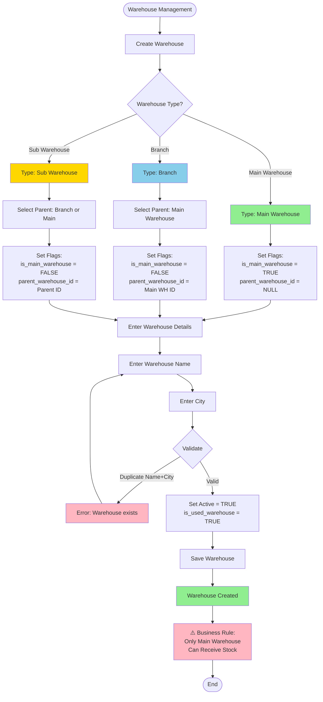

---

## 3. Product & Variant Setup Flow

```mermaid
flowchart TD
    Start([Product Setup]) --> ProductType{Product Type?}

    ProductType -->|Simple Product| SimpleProduct[Simple Product<br/>No Variants]
    ProductType -->|Variable Product| VariableProduct[Variable Product<br/>Has Variants]

    %% Simple Product Flow
    SimpleProduct --> CreateProduct[Create Product]
    CreateProduct --> ProductCode[Enter Product Code - UNIQUE]
    ProductCode --> ProductName[Enter Product Name]
    ProductName --> SelectGroup[Select Product Group]
    SelectGroup --> SelectCategory[Select Category]
    SelectCategory --> SelectBrand[Select Brand - Optional]
    SelectBrand --> SelectBaseUOM[Select Base UOM]

    SelectBaseUOM --> ProductFlags[Set Product Flags]
    ProductFlags --> TrackInv["track_inventory = TRUE"]
    TrackInv --> HasVariantNo["has_variant = FALSE"]
    HasVariantNo --> BatchSerial{Batch or Serial?}

    BatchSerial -->|Batch| SetBatch["has_batch = TRUE<br/>has_serial = FALSE"]
    BatchSerial -->|Serial| SetSerial["has_serial = TRUE<br/>has_batch = FALSE"]
    BatchSerial -->|Both| SetBoth["has_batch = TRUE<br/>has_serial = TRUE"]
    BatchSerial -->|None| SetNone["has_batch = FALSE<br/>has_serial = FALSE"]

    SetBatch --> ReorderLevel
    SetSerial --> ReorderLevel
    SetBoth --> ReorderLevel
    SetNone --> ReorderLevel[Enter Reorder Level]

    ReorderLevel --> AllowNegative{Allow Negative Stock?}
    AllowNegative -->|Yes| NegativeYes["allow_negative_stock = TRUE"]
    AllowNegative -->|No| NegativeNo["allow_negative_stock = FALSE"]

    NegativeYes --> SaveProduct[Save Product]
    NegativeNo --> SaveProduct

    SaveProduct --> AddAlternateUOM{Add Alternate UOMs?}
    AddAlternateUOM -->|Yes| AddProductUOM[Add Product UOM]
    AddAlternateUOM -->|No| ProductComplete

    AddProductUOM --> SelectUOM[Select UOM]
    SelectUOM --> EnterFactor["Enter factor_to_base<br/>Example: 1 Box = 12 Pieces<br/>factor = 12"]
    EnterFactor --> IsBaseUOM{Is Base UOM?}
    IsBaseUOM -->|Yes| SetBaseTrue["is_base = TRUE"]
    IsBaseUOM -->|No| SetBaseFalse["is_base = FALSE"]

    SetBaseTrue --> SaveUOM[Save Product UOM]
    SetBaseFalse --> SaveUOM
    SaveUOM --> MoreUOM{Add More UOMs?}

    MoreUOM -->|Yes| AddProductUOM
    MoreUOM -->|No| ProductComplete[Product Setup Complete]

    ProductComplete --> End1([End])

    %% Variable Product Flow
    VariableProduct --> CreateVarProduct[Create Variable Product]
    CreateVarProduct --> VarProductCode[Enter Product Code]
    VarProductCode --> VarProductName[Enter Product Name]
    VarProductName --> VarSelectGroup[Select Group/Category/Brand]
    VarSelectGroup --> VarSelectBaseUOM[Select Base UOM]
    VarSelectBaseUOM --> VarFlags["Set Flags:<br/>track_inventory = TRUE<br/>has_variant = TRUE"]

    VarFlags --> DefineAttributes[Define Attributes]
    DefineAttributes --> CreateAttribute{Create Attribute?}

    CreateAttribute -->|New Attribute| NewAttribute[Create New Attribute<br/>e.g., Color, Size]
    CreateAttribute -->|Use Existing| SelectAttribute[Select Existing Attribute]

    NewAttribute --> AttributeName[Enter Attribute Name]
    AttributeName --> SaveAttribute[Save Attribute]
    SaveAttribute --> AddAttributeValues

    SelectAttribute --> AddAttributeValues[Add Attribute Values]
    AddAttributeValues --> ValueName["Enter Value<br/>e.g., Red, Blue, M, L"]
    ValueName --> SaveValue[Save Attribute Value]
    SaveValue --> MoreValues{Add More Values?}

    MoreValues -->|Yes| AddAttributeValues
    MoreValues -->|No| MoreAttributes{Add More Attributes?}

    MoreAttributes -->|Yes| CreateAttribute
    MoreAttributes -->|No| SaveVarProduct[Save Variable Product]

    SaveVarProduct --> GenerateVariants[Generate Variants]
    GenerateVariants --> SelectCombination["Select Attribute Combinations:<br/>Example: Red-M, Red-L, Blue-M, Blue-L"]

    SelectCombination --> CreateVariant[Create Product Variant]
    CreateVariant --> GenerateSKU["Generate SKU:<br/>Format: PROD001-R-M"]
    GenerateSKU --> LinkAttributes[Link Variant to Attribute Values]
    LinkAttributes --> SetVariantUOM[Set Variant Base UOM]
    SetVariantUOM --> SaveVariant[Save Variant]

    SaveVariant --> MoreVariants{Generate More Variants?}
    MoreVariants -->|Yes| CreateVariant
    MoreVariants -->|No| VariantComplete[Variants Setup Complete]

    VariantComplete --> End2([End])

    style SimpleProduct fill:#90EE90
    style VariableProduct fill:#87CEEB
    style ProductComplete fill:#90EE90
    style VariantComplete fill:#90EE90
```

---

## 4. Stock Receive (GRN) Process - Detailed

```mermaid
flowchart TD
    Start([Stock Receive - GRN]) --> InitGRN[Initialize GRN]
    InitGRN --> StatusDraft[Status: DRAFT]
    StatusDraft --> SelectSource{Select Source Type}

    SelectSource -->|Purchase Order| SourcePO[Source: PURCHASE_ORDER]
    SelectSource -->|Stock Return| SourceReturn[Source: STOCK_RETURN]
    SelectSource -->|Transfer In| SourceTransfer[Source: TRANSFER_IN]
    SelectSource -->|Other| SourceOther[Source: Other]

    SourcePO --> LinkPO[Link to Purchase Order]
    LinkPO --> LoadPOLines["Load PO Lines:<br/>- Product/Variant<br/>- Ordered Qty<br/>- Received Qty<br/>- Pending Qty"]
    LoadPOLines --> SelectWarehouse

    SourceReturn --> LinkReturn[Link to Stock Return]
    LinkReturn --> SelectWarehouse

    SourceTransfer --> LinkTransfer[Link to Transfer]
    LinkTransfer --> SelectWarehouse

    SourceOther --> SelectWarehouse[Select Warehouse]

    SelectWarehouse --> ValidateWH{Is Main Warehouse?}
    ValidateWH -->|No| ErrorMainWH["❌ Error:<br/>Only Main Warehouse<br/>Can Receive Stock"]
    ErrorMainWH --> End1([End - Failed])

    ValidateWH -->|Yes| SelectSupplier[Select Supplier - Optional]
    SelectSupplier --> SetReceiveDate[Set Receive Date]
    SetReceiveDate --> AddGRNLines[Add GRN Lines]

    AddGRNLines --> SelectProduct[Select Product]
    SelectProduct --> CheckHasVariant{Product has_variant?}

    CheckHasVariant -->|Yes| SelectVariant[Select Variant - REQUIRED]
    CheckHasVariant -->|No| SelectTransactionUOM

    SelectVariant --> VariantSelected{Variant Selected?}
    VariantSelected -->|No| ErrorNoVariant[Error: Variant Required]
    ErrorNoVariant --> SelectVariant
    VariantSelected -->|Yes| SelectTransactionUOM

    SelectTransactionUOM[Select Transaction UOM]
    SelectTransactionUOM --> LoadAvailableUOM["Load Product UOMs:<br/>- Base UOM<br/>- Alternate UOMs<br/>- Conversion Factors"]

    LoadAvailableUOM --> PickUOM[Pick UOM for Transaction]
    PickUOM --> EnterQty[Enter Receive Quantity]
    EnterQty --> ValidateQty{Quantity > 0?}

    ValidateQty -->|No| ErrorQty[Error: Invalid Quantity]
    ErrorQty --> EnterQty

    ValidateQty -->|Yes| CheckPOLink{Linked to PO?}
    CheckPOLink -->|Yes| ValidatePOQty{Qty <= Pending Qty?}
    ValidatePOQty -->|No| WarnOverReceive["⚠️ Warning:<br/>Quantity exceeds<br/>PO pending quantity"]
    WarnOverReceive --> ContinueOverReceive{Continue?}
    ContinueOverReceive -->|No| EnterQty
    ContinueOverReceive -->|Yes| EnterUnitPrice

    ValidatePOQty -->|Yes| EnterUnitPrice
    CheckPOLink -->|No| EnterUnitPrice[Enter Unit Price]

    EnterUnitPrice --> ConvertToBase["Convert to Base UOM:<br/><br/>base_quantity = quantity × factor_to_base<br/>base_unit_price = unit_price ÷ factor_to_base"]

    ConvertToBase --> CalcLineTotals["Calculate Line Totals:<br/><br/>line_total = quantity × unit_price<br/>base_line_total = base_quantity × base_unit_price"]

    CalcLineTotals --> TaxDiscount{Add Tax/Discount?}
    TaxDiscount -->|Yes| EnterTaxDiscount[Enter Tax & Discount]
    TaxDiscount -->|No| CheckBatch
    EnterTaxDiscount --> CheckBatch{Product has_batch?}

    CheckBatch -->|Yes| EnterBatch[Enter Batch Number]
    CheckBatch -->|No| CheckSerial

    EnterBatch --> BatchExpiry{Enter Expiry Date?}
    BatchExpiry -->|Yes| SetExpiry[Set Batch Expiry Date]
    BatchExpiry -->|No| CheckSerial
    SetExpiry --> CheckSerial{Product has_serial?}

    CheckSerial -->|Yes| EnterSerial[Enter Serial Numbers]
    EnterSerial --> ValidateSerial["Validate Serial:<br/>- Must be UNIQUE<br/>- Quantity must = 1 per serial"]

    ValidateSerial --> SerialValid{Valid?}
    SerialValid -->|No| ErrorSerial["Error:<br/>- Duplicate Serial<br/>- Invalid Quantity"]
    ErrorSerial --> EnterSerial

    SerialValid -->|Yes| SaveGRNLine
    CheckSerial -->|No| SaveGRNLine[Save GRN Line]

    SaveGRNLine --> UpdateGRNTotal["Update GRN Totals:<br/>total_amount += line_total<br/>total_tax += tax<br/>grand_total = total_amount + total_tax"]

    UpdateGRNTotal --> MoreLines{Add More Lines?}
    MoreLines -->|Yes| AddGRNLines
    MoreLines -->|No| ReviewGRN[Review GRN]

    ReviewGRN --> ShowGRNSummary["Display Summary:<br/>- Total Lines<br/>- Total Quantity (base)<br/>- Total Amount<br/>- Grand Total"]

    ShowGRNSummary --> AddRemarks{Add Remarks?}
    AddRemarks -->|Yes| EnterRemarks[Enter Remarks]
    AddRemarks -->|No| GRNAction
    EnterRemarks --> GRNAction{User Action}

    GRNAction -->|Save Draft| SaveDraftGRN[Save as DRAFT]
    GRNAction -->|Post GRN| ValidateGRN{Validate GRN}
    GRNAction -->|Cancel| CancelGRN[Discard GRN]

    ValidateGRN -->|Invalid| ShowErrors[Show Validation Errors]
    ShowErrors --> AddGRNLines

    ValidateGRN -->|Valid| PostGRN[Status: POSTED]
    PostGRN --> LockGRN[Lock GRN - No Edits]

    LockGRN --> ProcessLines[Process Each GRN Line]
    ProcessLines --> WriteLedger["Write Stock Ledger:<br/><br/>- stock_type = 'IN'<br/>- warehouse_id<br/>- product_id<br/>- variant_id<br/>- base_quantity<br/>- base_value<br/>- reference_type = 'STOCK_RECEIVE'<br/>- reference_id = GRN ID"]

    WriteLedger --> WriteMovement["Write Stock Movement Detail:<br/><br/>- movement_type = 'IN'<br/>- warehouse_id<br/>- product_id<br/>- variant_id<br/>- batch_no<br/>- serial_no<br/>- quantity (base UOM)<br/>- reference_type<br/>- reference_id<br/>- reference_line_id"]

    WriteMovement --> UpdatePOLine{Linked to PO Line?}
    UpdatePOLine -->|Yes| IncrementPOReceived["Update PO Line:<br/>received_quantity += quantity"]
    UpdatePOLine -->|No| NextLine

    IncrementPOReceived --> CheckPOLineStatus{received_qty = qty?}
    CheckPOLineStatus -->|Yes| POLineClosed[PO Line Status: CLOSED]
    CheckPOLineStatus -->|No| POLinePartial[PO Line Status: PARTIAL]

    POLineClosed --> NextLine{More Lines?}
    POLinePartial --> NextLine

    NextLine -->|Yes| ProcessLines
    NextLine -->|No| UpdatePOStatus{Update PO Status?}

    UpdatePOStatus -->|Yes| CheckAllPOLines{All Lines Closed?}
    CheckAllPOLines -->|Yes| POFullReceived[PO Status: FULL_RECEIVED]
    CheckAllPOLines -->|No| POPartialReceived[PO Status: PARTIAL_RECEIVED]

    POFullReceived --> GenerateGRNNo
    POPartialReceived --> GenerateGRNNo
    UpdatePOStatus -->|No| GenerateGRNNo

    GenerateGRNNo["Generate GRN Number:<br/>GRN-YYYYMMDD-XXXX"]
    GenerateGRNNo --> AuditLog["Audit Log:<br/>- Posted By<br/>- Posted On<br/>- Last Action: POST"]

    SaveDraftGRN --> AuditLog
    AuditLog --> NotifySuccess[Notify: Stock Updated]
    NotifySuccess --> UpdateBalance["Update Stock Balance:<br/>Available Qty Increased"]

    UpdateBalance --> PrintGRN{Print GRN?}
    PrintGRN -->|Yes| GenerateGRNPDF[Generate GRN Report]
    PrintGRN -->|No| Success
    GenerateGRNPDF --> Success[GRN Complete]

    Success --> End2([End - Success])
    CancelGRN --> End3([End - Cancelled])

    style Start fill:#90EE90
    style End1 fill:#FFB6C1
    style End2 fill:#90EE90
    style End3 fill:#FFD700
    style PostGRN fill:#87CEEB
    style WriteLedger fill:#87CEEB
    style WriteMovement fill:#DDA0DD
    style ErrorMainWH fill:#FFB6C1
    style ErrorNoVariant fill:#FFB6C1
    style ErrorQty fill:#FFB6C1
    style ErrorSerial fill:#FFB6C1
    style WarnOverReceive fill:#FFD700
```

---

## 5. Stock Delivery Process - Detailed

```mermaid
flowchart TD
    Start([Stock Delivery]) --> InitDelivery[Initialize Delivery]
    InitDelivery --> SelectDeliveryType{Select Delivery Type}

    SelectDeliveryType -->|SALE| TypeSale["Type: SALE<br/>Requires Customer"]
    SelectDeliveryType -->|ISSUE| TypeIssue["Type: ISSUE<br/>Requires Department"]
    SelectDeliveryType -->|WRITE_OFF| TypeWriteOff["Type: WRITE_OFF<br/>Stock Disposal"]
    SelectDeliveryType -->|CONSUMPTION| TypeConsumption["Type: CONSUMPTION<br/>Internal Use"]

    TypeSale --> SelectWarehouse
    TypeIssue --> SelectWarehouse
    TypeWriteOff --> SelectWarehouse
    TypeConsumption --> SelectWarehouse[Select Source Warehouse]

    SelectWarehouse --> CheckWarehouseActive{Warehouse Active?}
    CheckWarehouseActive -->|No| ErrorInactiveWH[Error: Warehouse Inactive]
    ErrorInactiveWH --> End1([End - Failed])

    CheckWarehouseActive -->|Yes| DeliveryDetails{Delivery Type}
    DeliveryDetails -->|SALE| SelectCustomer[Select Customer]
    DeliveryDetails -->|ISSUE/CONSUMPTION| SelectDepartment[Select Department]
    DeliveryDetails -->|WRITE_OFF| SetDeliveryDate

    SelectCustomer --> SetDeliveryDate[Set Delivery Date]
    SelectDepartment --> SetDeliveryDate

    SetDeliveryDate --> AddDeliveryLines[Add Delivery Lines]
    AddDeliveryLines --> SelectProductDel[Select Product]
    SelectProductDel --> CheckVariantDel{Product has_variant?}

    CheckVariantDel -->|Yes| SelectVariantDel[Select Variant - REQUIRED]
    CheckVariantDel -->|No| SelectUOMDel

    SelectVariantDel --> VariantSelectedDel{Variant Selected?}
    VariantSelectedDel -->|No| ErrorNoVariantDel[Error: Variant Required]
    ErrorNoVariantDel --> SelectVariantDel
    VariantSelectedDel -->|Yes| SelectUOMDel

    SelectUOMDel[Select Transaction UOM]
    SelectUOMDel --> LoadUOMDel["Load Product UOMs:<br/>Available UOM Options"]
    LoadUOMDel --> EnterQtyDel[Enter Delivery Quantity]

    EnterQtyDel --> ValidateQtyDel{Quantity > 0?}
    ValidateQtyDel -->|No| ErrorQtyDel[Error: Invalid Quantity]
    ErrorQtyDel --> EnterQtyDel

    ValidateQtyDel -->|Yes| ConvertToBaseDel["Convert to Base UOM:<br/>base_quantity = quantity × factor_to_base"]

    ConvertToBaseDel --> CheckStockAvailable["Query Stock Ledger:<br/><br/>Available = SUM(IN) - SUM(OUT)<br/>WHERE warehouse_id = X<br/>AND product_id = Y<br/>AND variant_id = Z"]

    CheckStockAvailable --> StockSufficient{Available >= base_qty?}
    StockSufficient -->|No| CheckNegativeAllowed{allow_negative_stock?}

    CheckNegativeAllowed -->|No| ErrorInsufficientStock["❌ Error:<br/>Insufficient Stock<br/>Available: X<br/>Required: Y"]
    ErrorInsufficientStock --> EnterQtyDel

    CheckNegativeAllowed -->|Yes| WarnNegativeStock["⚠️ Warning:<br/>This will create<br/>Negative Stock"]
    WarnNegativeStock --> ProceedNegative{Continue?}
    ProceedNegative -->|No| EnterQtyDel
    ProceedNegative -->|Yes| CalculateCost

    StockSufficient -->|Yes| CalculateCost["Calculate Unit Cost:<br/><br/>Using FIFO or AVG Method"]

    CalculateCost --> CalcCostTotal["Line Cost:<br/>line_total_cost = base_quantity × unit_cost"]

    CalcCostTotal --> CheckBatchSerialDel{Batch/Serial Required?}
    CheckBatchSerialDel -->|No| SaveDeliveryLine

    CheckBatchSerialDel -->|Yes| LoadBatchSerial["Load Available:<br/><br/>Query Stock Movement Detail<br/>WHERE warehouse = X<br/>AND product = Y<br/>AND movement_type = 'IN'<br/>AND NOT already used"]

    LoadBatchSerial --> ShowBatchSerial[Show Available Batch/Serials]
    ShowBatchSerial --> SelectBatchSerial[Select Batch/Serial]
    SelectBatchSerial --> ValidateBatchSerial{Valid Selection?}

    ValidateBatchSerial -->|No| ErrorBatchSerial["Error:<br/>- Invalid Batch<br/>- Serial Already Used<br/>- Insufficient Batch Qty"]
    ErrorBatchSerial --> SelectBatchSerial

    ValidateBatchSerial -->|Yes| ReserveBatchSerial["Reserve Batch/Serial:<br/>Mark as Allocated"]

    ReserveBatchSerial --> SaveDeliveryLine[Save Delivery Line]
    SaveDeliveryLine --> MoreLinesDel{Add More Lines?}

    MoreLinesDel -->|Yes| AddDeliveryLines
    MoreLinesDel -->|No| ReviewDelivery[Review Delivery]

    ReviewDelivery --> ShowDeliverySummary["Display Summary:<br/>- Total Lines<br/>- Total Quantity<br/>- Total Cost<br/>- Stock Impact"]

    ShowDeliverySummary --> AddRemarksDel{Add Remarks?}
    AddRemarksDel -->|Yes| EnterRemarksDel[Enter Remarks]
    AddRemarksDel -->|No| DeliveryAction
    EnterRemarksDel --> DeliveryAction{User Action}

    DeliveryAction -->|Save Draft| SaveDraftDel[Save as DRAFT]
    DeliveryAction -->|Post Delivery| ValidateDelivery{Validate Delivery}
    DeliveryAction -->|Cancel| CancelDel[Discard Delivery]

    ValidateDelivery -->|Invalid| ShowErrorsDel[Show Validation Errors]
    ShowErrorsDel --> AddDeliveryLines

    ValidateDelivery -->|Valid| PostDelivery[Post Delivery]
    PostDelivery --> LockDelivery[Lock Delivery - No Edits]

    LockDelivery --> ProcessLinesDel[Process Each Delivery Line]
    ProcessLinesDel --> WriteLedgerOut["Write Stock Ledger:<br/><br/>- stock_type = 'OUT'<br/>- warehouse_id<br/>- product_id<br/>- variant_id<br/>- base_quantity (NEGATIVE)<br/>- value (NEGATIVE)<br/>- reference_type = 'STOCK_DELIVERY'<br/>- reference_id = Delivery ID"]

    WriteLedgerOut --> WriteMovementOut["Write Stock Movement Detail:<br/><br/>- movement_type = 'OUT'<br/>- warehouse_id<br/>- product_id<br/>- variant_id<br/>- batch_no<br/>- serial_no<br/>- quantity (base UOM)<br/>- reference_type<br/>- reference_id<br/>- reference_line_id"]

    WriteMovementOut --> UpdateSerialStatus{Has Serial?}
    UpdateSerialStatus -->|Yes| MarkSerialUsed["Mark Serial as USED:<br/>Update serial status<br/>Link to sale/delivery"]
    UpdateSerialStatus -->|No| NextLineDel

    MarkSerialUsed --> NextLineDel{More Lines?}
    NextLineDel -->|Yes| ProcessLinesDel
    NextLineDel -->|No| GenerateDeliveryNo

    GenerateDeliveryNo["Generate Delivery Number:<br/>DEL-YYYYMMDD-XXXX"]
    GenerateDeliveryNo --> AuditLogDel["Audit Log:<br/>- Posted By<br/>- Posted On<br/>- Last Action: POST"]

    SaveDraftDel --> AuditLogDel
    AuditLogDel --> NotifySuccessDel[Notify: Stock Reduced]
    NotifySuccessDel --> UpdateBalanceDel["Update Stock Balance:<br/>Available Qty Decreased"]

    UpdateBalanceDel --> LinkToInvoice{Link to Sales Invoice?}
    LinkToInvoice -->|Yes| CreateSalesInvoice[Create Sales Invoice]
    LinkToInvoice -->|No| PrintDelivery

    CreateSalesInvoice --> PrintDelivery{Print Delivery Note?}
    PrintDelivery -->|Yes| GenerateDeliveryPDF[Generate Delivery Note]
    PrintDelivery -->|No| SuccessDel
    GenerateDeliveryPDF --> SuccessDel[Delivery Complete]

    SuccessDel --> End2([End - Success])
    CancelDel --> End3([End - Cancelled])

    style Start fill:#90EE90
    style End1 fill:#FFB6C1
    style End2 fill:#90EE90
    style End3 fill:#FFD700
    style PostDelivery fill:#FF6B6B
    style WriteLedgerOut fill:#FF6B6B
    style WriteMovementOut fill:#FFB6C1
    style ErrorInactiveWH fill:#FFB6C1
    style ErrorNoVariantDel fill:#FFB6C1
    style ErrorQtyDel fill:#FFB6C1
    style ErrorInsufficientStock fill:#FFB6C1
    style ErrorBatchSerial fill:#FFB6C1
    style WarnNegativeStock fill:#FFD700
```

---

## 6. Stock Balance Calculation Flow

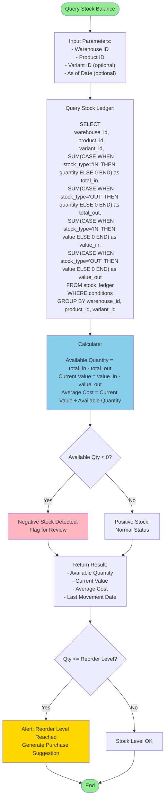

---

## 7. Batch and Serial Tracking Flow

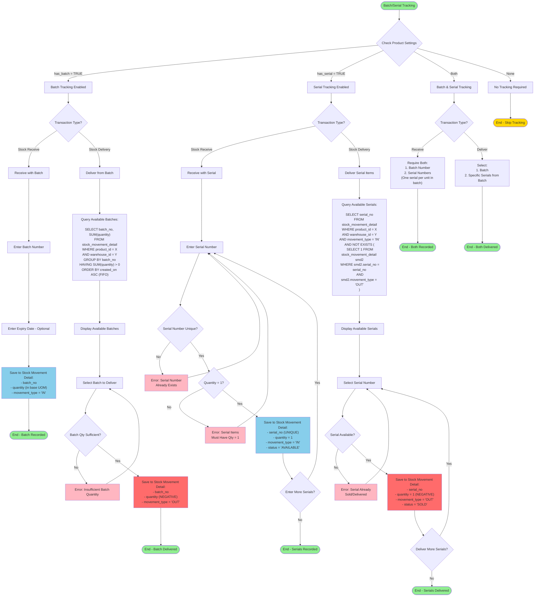

---

## 8. Stock Ledger State Transitions

### Stock Receive Status Flow
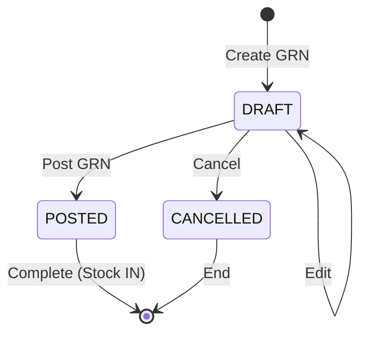

### Stock Delivery Status Flow
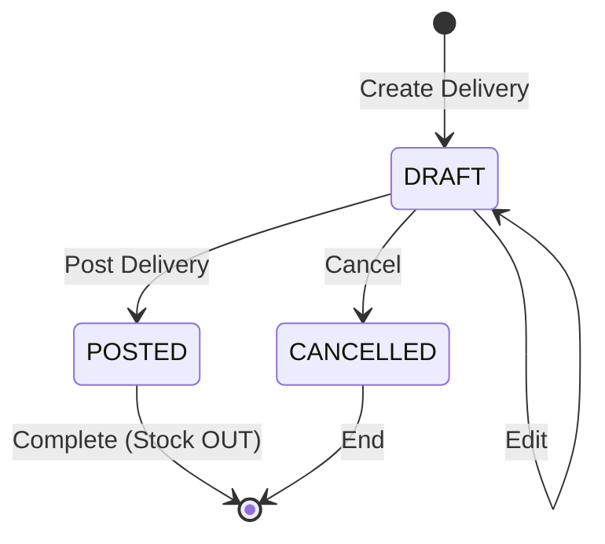

---

## 9. Key Business Rules

### Warehouse Rules:
1. ✅ **Main Warehouse**: Only warehouses with `is_main_warehouse = TRUE` can receive stock
2. ✅ **Hierarchy**: Main → Branch → Sub warehouse structure
3. ✅ **Unique**: UNIQUE(name, city) to prevent duplicates
4. ✅ **Active Flag**: Use `active` flag for soft delete

### Product Rules:
1. ✅ **Code**: Must be UNIQUE
2. ✅ **Track Inventory**: If `track_inventory = FALSE`, no stock transactions allowed
3. ✅ **Variants**: If `has_variant = TRUE`, variant selection is REQUIRED in transactions
4. ✅ **Batch**: If `has_batch = TRUE`, batch number REQUIRED on receive/deliver
5. ✅ **Serial**: If `has_serial = TRUE`, serial number REQUIRED and quantity MUST = 1
6. ✅ **Negative Stock**: Controlled by `allow_negative_stock` flag

### UOM Rules:
1. ✅ **Base UOM**: Every product must have ONE base UOM
2. ✅ **Conversion**: All transactions converted to base UOM before posting
3. ✅ **Factor**: `base_quantity = transaction_quantity × factor_to_base`
4. ✅ **Alternate UOMs**: Multiple UOMs allowed per product

### Product Variant Rules:
1. ✅ **SKU**: Must be UNIQUE across all variants
2. ✅ **Attributes**: Each variant must have attribute values defined
3. ✅ **Stock Tracking**: Variants inherit from parent product or can override

### Stock Receive Rules:
1. ✅ **Warehouse**: MUST be Main Warehouse
2. ✅ **Status**: Only POSTED status updates Stock Ledger
3. ✅ **Auto Number**: GRN-YYYYMMDD-XXXX format
4. ✅ **UOM Conversion**: Always convert to base UOM
5. ✅ **Immutable**: Cannot edit after POSTED

### Stock Delivery Rules:
1. ✅ **Stock Validation**: Check stock availability before posting
2. ✅ **Negative Stock**: Honor `allow_negative_stock` flag
3. ✅ **Cost Method**: Use FIFO or AVG for cost calculation
4. ✅ **Serial Validation**: Serial numbers must be available and not used
5. ✅ **Batch FIFO**: Default to FIFO for batch selection

### Stock Ledger Rules:
1. ✅ **Immutable**: NEVER update or delete ledger entries
2. ✅ **Base UOM**: All entries MUST be in base UOM
3. ✅ **Stock Type**: IN or OUT only
4. ✅ **Single Source**: Only Stock Service can write to ledger
5. ✅ **Balance Calculation**: Balance = SUM(IN) - SUM(OUT)

### Stock Movement Detail Rules:
1. ✅ **Batch/Serial**: Store all batch and serial movements
2. ✅ **Base UOM**: Quantity always in base UOM
3. ✅ **Serial Unique**: Serial numbers globally UNIQUE
4. ✅ **Serial Quantity**: Must be 1 for serial items
5. ✅ **Traceability**: Link to source document via reference_type and reference_id

---

## 10. UOM Conversion Examples

### Example 1: Box to Pieces
```
Product: Pencil
Base UOM: Piece (pc)
Alternate UOM: Box

UOM Conversion:
- 1 Box = 12 Pieces
- factor_to_base = 12

Transaction: Receive 5 Boxes
Calculation:
- transaction_quantity = 5 (Box)
- base_quantity = 5 × 12 = 60 (Pieces)

Stock Ledger Entry:
- quantity = 60 (Pieces)
```

### Example 2: Carton to Pieces
```
Product: Notebook
Base UOM: Piece (pc)
Alternate UOMs:
- Pack (1 Pack = 10 Pieces, factor = 10)
- Carton (1 Carton = 50 Pieces, factor = 50)

Transaction: Receive 3 Cartons
Calculation:
- transaction_quantity = 3 (Carton)
- base_quantity = 3 × 50 = 150 (Pieces)

Stock Ledger Entry:
- quantity = 150 (Pieces)
```

### Example 3: Weight Conversion
```
Product: Rice
Base UOM: Kilogram (kg)
Alternate UOM: Gram (g)

UOM Conversion:
- 1 kg = 1000 g
- factor_to_base = 0.001 (for g to kg)

Transaction: Receive 5000 Grams
Calculation:
- transaction_quantity = 5000 (g)
- base_quantity = 5000 × 0.001 = 5 (kg)

Stock Ledger Entry:
- quantity = 5 (kg)
```

---

## 11. Integration with Other Modules

### With Purchase Module:
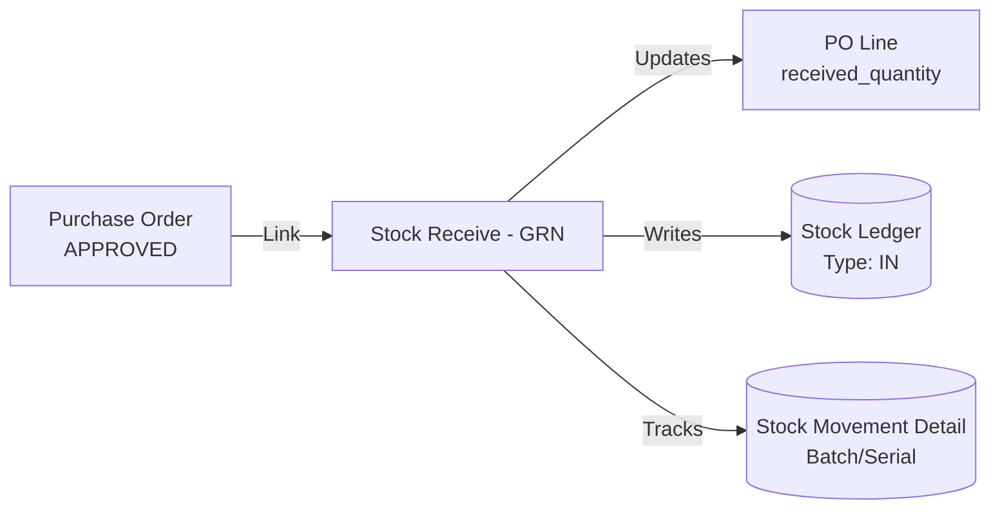

### With Sales Module:
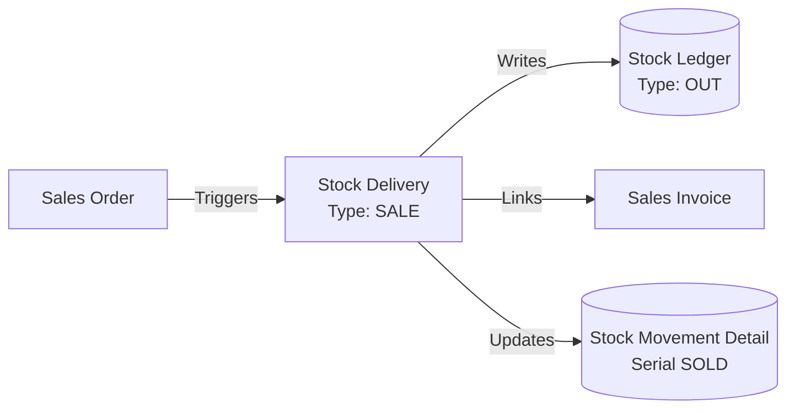

### With Finance Module:
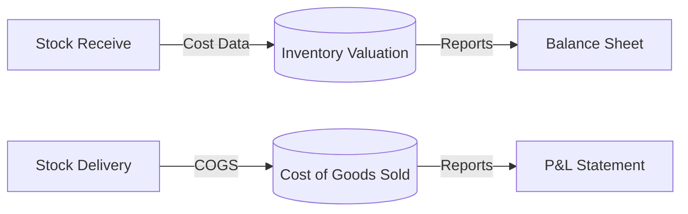

---

## 12. Sample Stock Movement Scenario

```
Scenario: Product Management with Variants

Step 1: Create Product
- Code: TS001
- Name: T-Shirt
- has_variant = TRUE
- Attributes: Color (Red, Blue), Size (M, L)

Step 2: Generate Variants
- TS001-R-M (Red, Medium)
- TS001-R-L (Red, Large)
- TS001-B-M (Blue, Medium)
- TS001-B-L (Blue, Large)

Step 3: Receive Stock (GRN)
- GRN-20260212-0001
- Warehouse: Main WH
- Variant: TS001-R-M
- Qty: 100 pieces
- Stock Ledger: +100 pieces

Step 4: Transfer to Branch (Future)
- Transfer from Main to Branch WH
- Qty: 50 pieces
- Main WH: -50 pieces
- Branch WH: +50 pieces

Step 5: Deliver (SALE)
- DEL-20260215-0001
- Warehouse: Main WH
- Variant: TS001-R-M
- Qty: 20 pieces
- Stock Ledger: -20 pieces

Current Balance:
- Main WH: 100 - 50 - 20 = 30 pieces
- Branch WH: 50 pieces
- Total: 80 pieces
```

---

## 13. Database Table Dependencies

```
Create Order (Top to Bottom):

1. Master Data (No dependencies):
   - UOM
   - Warehouse (self-reference)
   - Product Group
   - Product Brand
   - Attribute
   - Supplier (from Purchase module)

2. Level 2:
   - Product Category (→ Product Group)
   - Attribute Value (→ Attribute)

3. Level 3:
   - Product (→ Group, Category, Brand, UOM)

4. Level 4:
   - Product UOM (→ Product, UOM)
   - Product UOM Conversion (→ Product, UOM)
   - Product Variant (→ Product, UOM)

5. Level 5:
   - Product Variant Attribute (→ Variant, Attribute, Attribute Value)

6. Level 6:
   - Stock Receive (→ Warehouse, Supplier)
   - Stock Delivery (→ Warehouse)

7. Level 7:
   - Stock Receive Line (→ Stock Receive, Product, Variant, UOM)
   - Stock Delivery Line (→ Stock Delivery, Product, Variant, UOM)

8. Level 8:
   - Stock Ledger (→ Warehouse, Product, Variant, UOM)
   - Stock Movement Detail (→ Warehouse, Product, Variant)
```

---

**Document Created**: 2026-02-12
**Based on**: INVENTORY_DATABASE_NOTES.txt
**Diagram Tool**: Mermaid
**Purpose**: Complete Inventory Module Documentation with ERD and Process Flows
