# ERP Inventory System - Entity Relationship Diagram

## Full ERD Diagram

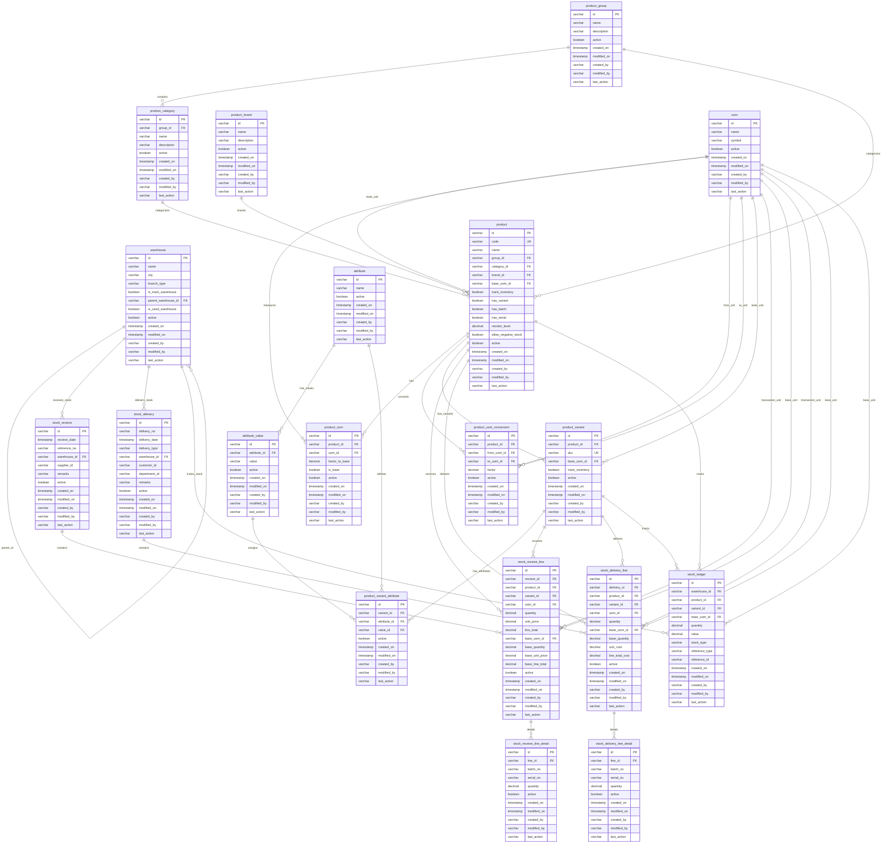

## Simplified View by Module

### Master Data Module
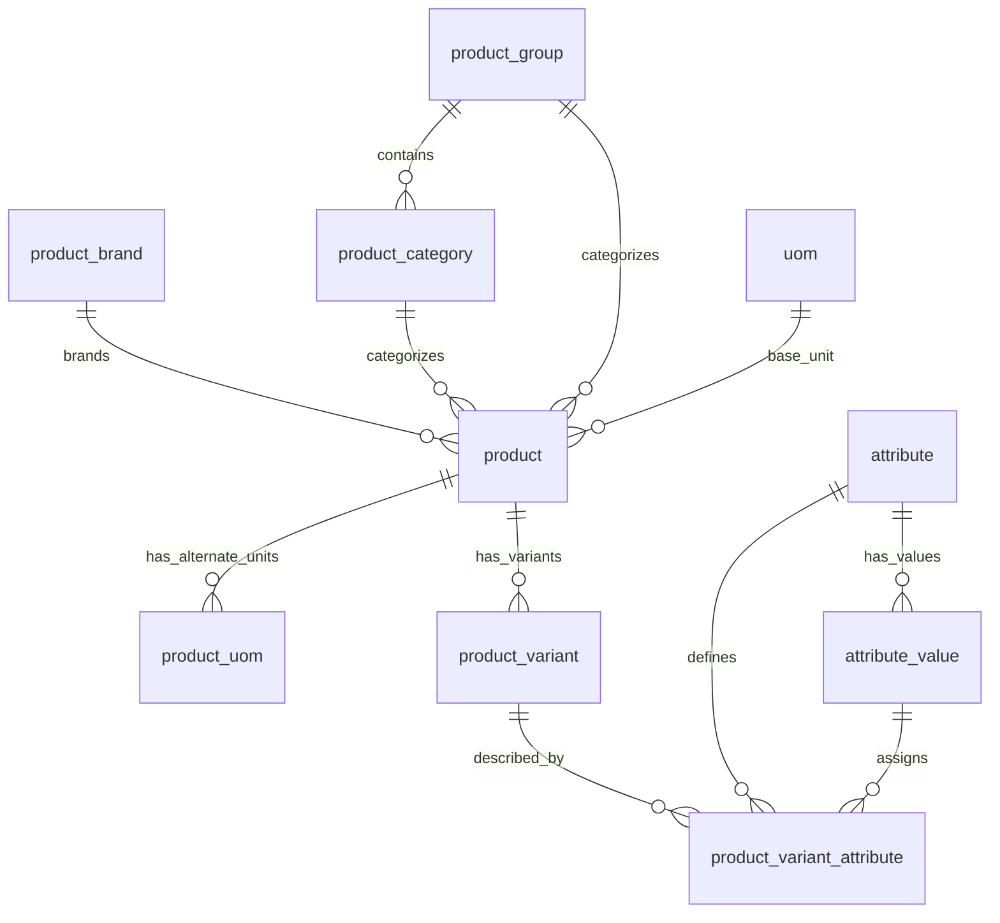

### Warehouse Module
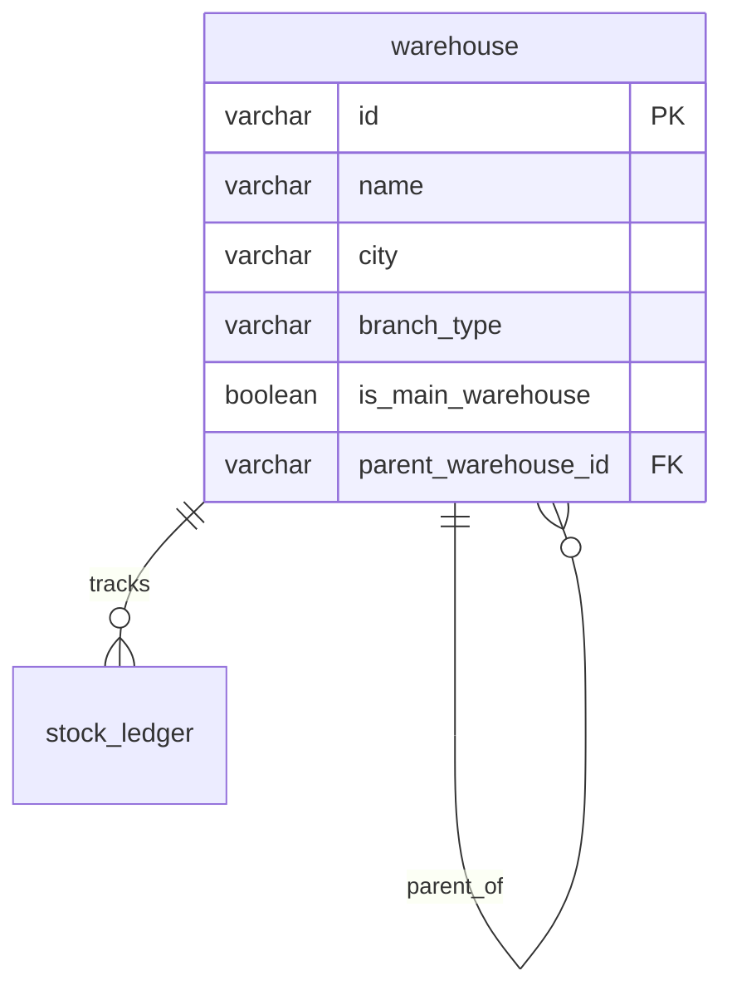

### Stock Receiving Module
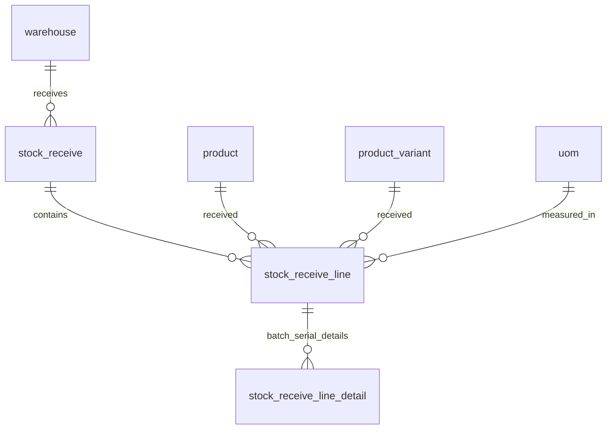

### Stock Delivery Module
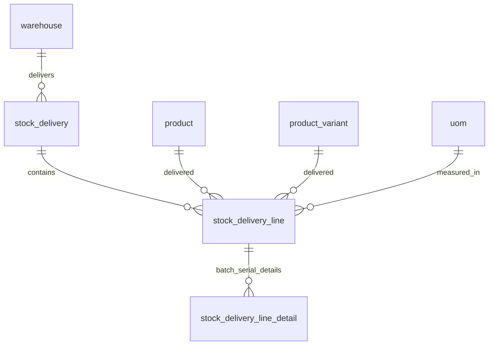

### Stock Ledger Module
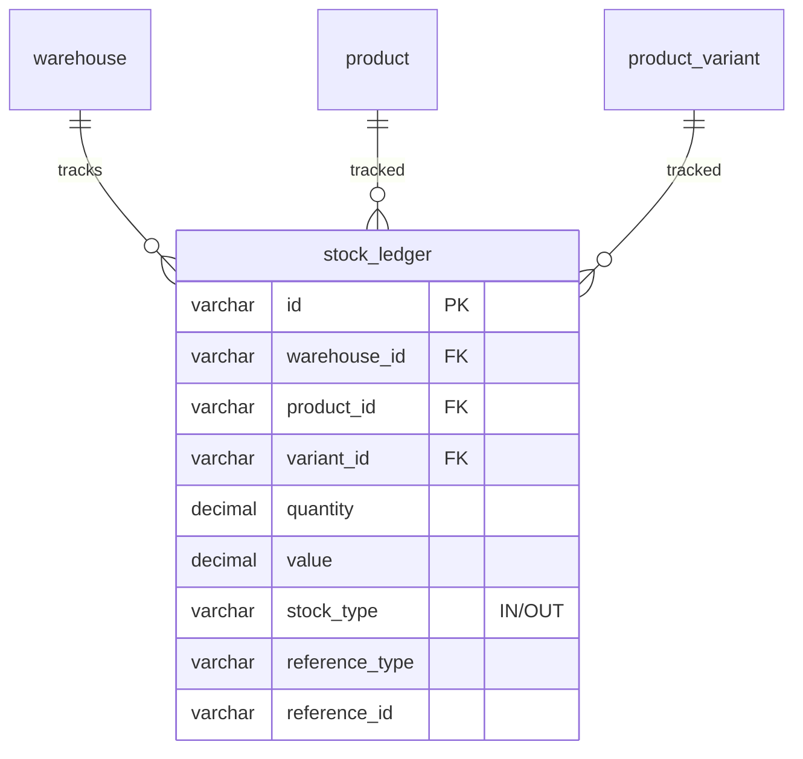

## Key Relationships Summary

### One-to-Many Relationships
- **Warehouse → Warehouse** (hierarchical: main → branch → sub)
- **Product Group → Product Category**
- **Product → Product Variant** (with attributes)
- **Product → Product UOM** (alternate units)
- **Attribute → Attribute Value**
- **Stock Receive → Stock Receive Line → Stock Receive Line Detail**
- **Stock Delivery → Stock Delivery Line → Stock Delivery Line Detail**

### Many-to-One Relationships
- **Product → Product Group, Product Category, Product Brand**
- **Product → UOM** (base unit)
- **Stock Receive → Warehouse** (must be main warehouse)
- **Stock Delivery → Warehouse**
- **Stock Ledger → Warehouse, Product, Product Variant**

### Junction Tables (Many-to-Many)
- **product_variant_attribute** links Variant ↔ Attribute ↔ Attribute Value
- **product_uom** links Product ↔ UOM
- **product_uom_conversion** links Product ↔ UOM (from) ↔ UOM (to)

## Business Rules Highlighted in ERD

1. **Warehouse Hierarchy**: `parent_warehouse_id` creates self-referencing relationship
2. **Main Warehouse Only**: Stock can only be received at warehouses where `is_main_warehouse = TRUE`
3. **Product Variants**: Only exist when `product.has_variant = TRUE`
4. **Batch/Serial Tracking**: `stock_receive_line_detail` and `stock_delivery_line_detail` store batch/serial numbers
5. **UOM Conversion**: Both `product_uom` and `product_uom_conversion` handle unit conversions
6. **Stock Ledger**: Immutable log of all stock movements (IN/OUT)
7. **Base Quantity**: All stock movements store both transaction UOM and base UOM quantities

## Notes
- PK = Primary Key
- FK = Foreign Key
- UK = Unique Key
- All tables include audit fields (created_on, modified_on, created_by, modified_by, last_action)
- All tables include `active` boolean for soft delete

---

# System Flowcharts

## Overall System Architecture Flow
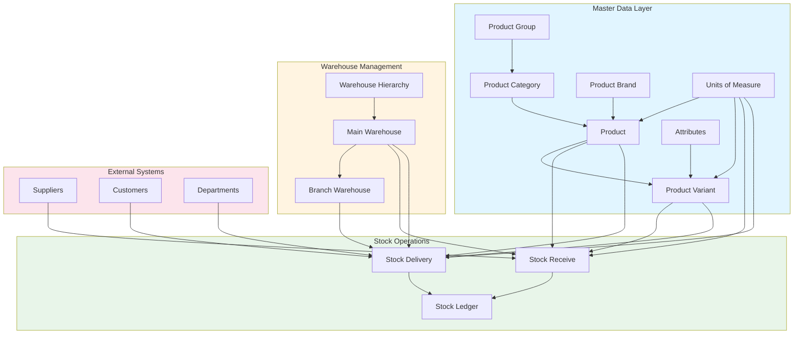

## Stock Receiving Process Flow
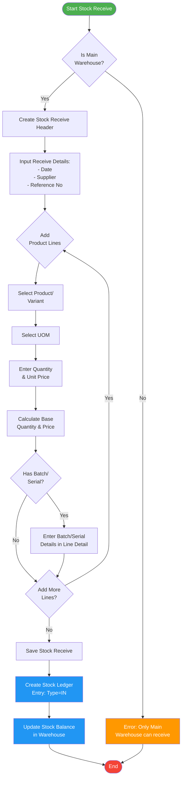

## Stock Delivery Process Flow
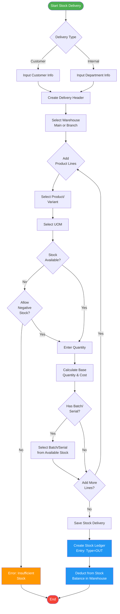

## Product Master Data Setup Flow
```mermaid
flowchart LR
    Start([Setup Product]) --> CreateGroup[Create Product Group]

    CreateGroup --> CreateCat[Create Product Category<br/>under Group]

    CreateCat --> CreateBrand[Create Product Brand]

    CreateBrand --> DefineUOM[Define Base UOM]

    DefineUOM --> CreateProduct[Create Product Master:<br/>- Code<br/>- Name<br/>- Group/Category<br/>- Brand<br/>- Base UOM]

    CreateProduct --> AddAltUOM[Add Alternate UOMs<br/>with Conversion Factors]

    AddAltUOM --> HasVariant{Has<br/>Variants?}

    HasVariant -->|No| SetTracking[Set Tracking Options:<br/>- Inventory<br/>- Batch<br/>- Serial]

    HasVariant -->|Yes| DefineAttr[Define Attributes:<br/>Size, Color, etc.]

    DefineAttr --> CreateAttrVal[Create Attribute Values]

    CreateAttrVal --> CreateVariant[Create Product Variants<br/>with SKU]

    CreateVariant --> AssignAttr[Assign Attribute Values<br/>to Each Variant]

    AssignAttr --> SetTracking

    SetTracking --> SetReorder[Set Reorder Level &<br/>Negative Stock Policy]

    SetReorder --> End([Product Ready])

    style Start fill:#4caf50,color:#fff
    style End fill:#2196f3,color:#fff
```

## Stock Ledger Update Flow
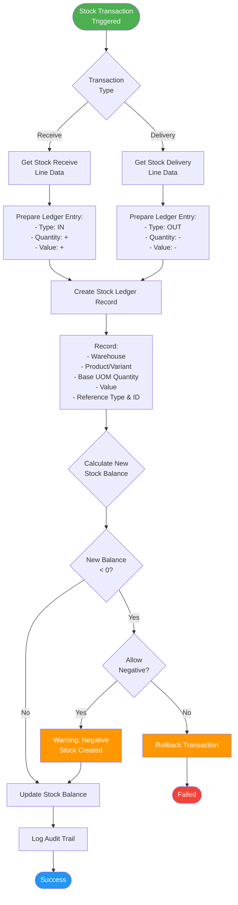

## UOM Conversion Flow
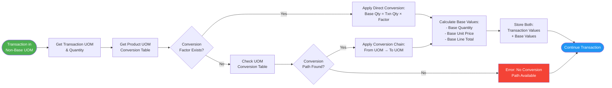

## Warehouse Hierarchy Flow
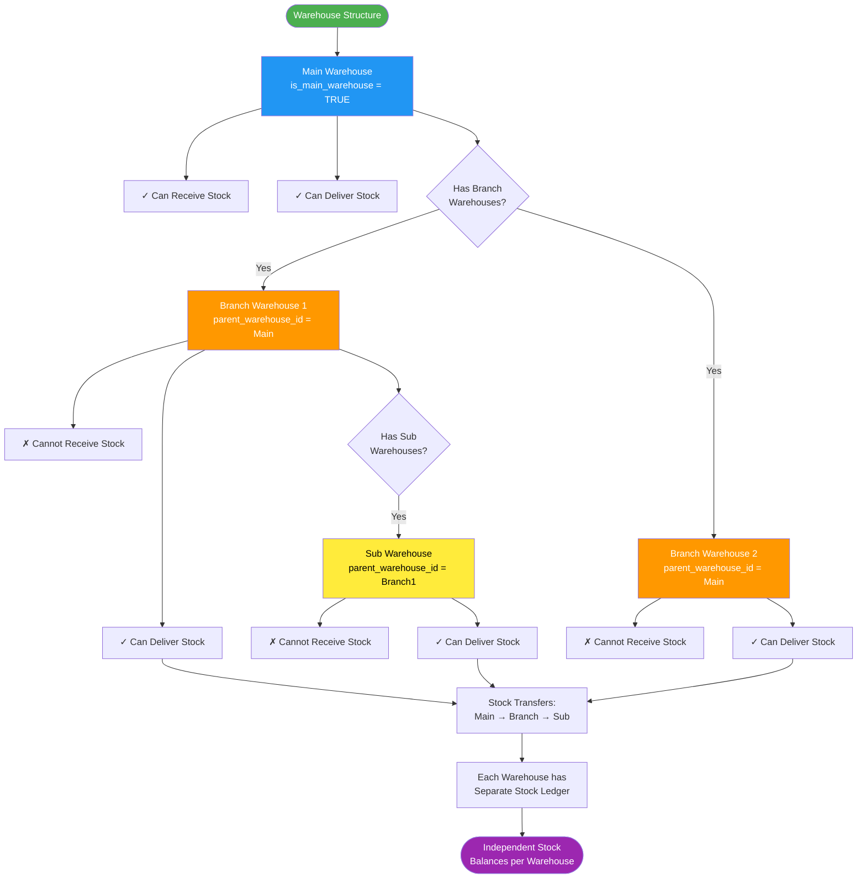
